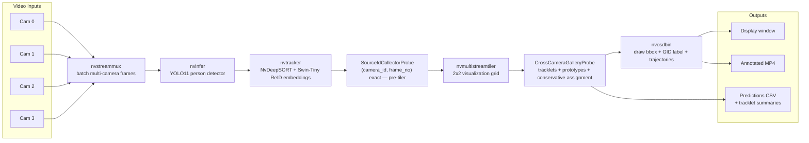

# Multi-Stream People Tracker

DeepStream 9.0 / pyservicemaker learning project for multi-camera people
detection, tracking, metadata extraction, and cross-camera ReID/MTMC
association.

Default detector: **YOLO11n COCO** via `configs/models/nvinfer_yolov11_people.yml`.
Default tracker: **NvDeepSORT + Swin-Tiny ReID** via
`configs/tracker/nvdeepsort_reid_swin.yaml`.

Best MTA result so far uses YOLO11n fine-tuned on MTA, Swin-Tiny ReID
fine-tuned on MTA, conservative realtime gallery matching, and delayed
tracklet-level offline merge:

| Eval setting | Global IDF1 | Pred IDs |
|--------------|:-----------:|:--------:|
| MTA default filter (`60x20`, visibility 30%) | 0.5801 | 1,827 |
| MTA medium strict (`80x30`, visibility 50%) | 0.6522 | 1,291 |
| MTA very strict (`100x40`, visibility 70%) | 0.7011 | 603 |

---

## Docker Quick Start For Mentor

Use Docker first when reviewing the project on another machine. It avoids a
manual DeepStream Python setup and keeps the run command predictable.

### Host Requirements

| Requirement | Notes |
|-------------|-------|
| NVIDIA driver | 590+ recommended for DeepStream 9.0 |
| Docker | with NVIDIA Container Toolkit |
| NGC access | `docker login nvcr.io` may be needed to pull DeepStream |
| Desktop display | optional; default Docker run is headless and saves video |

Quick GPU runtime check:

```bash
docker run --rm --gpus all nvidia/cuda:13.0.0-base-ubuntu24.04 nvidia-smi
```

If your Docker install requires root, use `sudo docker ...`. The helper scripts
auto-detect this and switch to `sudo docker` when needed.

### One-Time Setup

```bash
git clone <repo-url>
cd multi_stream_people_tracker

# If the DeepStream image is not already available:
docker login nvcr.io
# Username: $oauthtoken
# Password: <NGC API key>

# Allow container windows to open on the host X display.
xhost +local:docker

# Download the dataset, prepare models, and run a lightweight smoke check.
./scripts/prepare_demo.sh
```

For the stricter setup check that also builds the image and runs a container
import test:

```bash
./scripts/prepare_demo.sh --all
```

`prepare_dataset.sh` downloads NVIDIA's
`deepstream-tracker-3d-multi-view/assets/datasets.zip` and extracts the default
demo dataset into:

```text
dataset/mtmc_4cam/videos/Warehouse_Synthetic_Cam001.mp4
dataset/mtmc_4cam/videos/Warehouse_Synthetic_Cam002.mp4
dataset/mtmc_4cam/videos/Warehouse_Synthetic_Cam003.mp4
dataset/mtmc_4cam/videos/Warehouse_Synthetic_Cam004.mp4
```

If the dataset is already stored outside the repo, keep git lightweight and
point the script or Docker at that folder instead:

```bash
DATASET_DIR=/absolute/path/to/datasets ./scripts/prepare_dataset.sh
VIDEO_DIR=/absolute/path/to/datasets/mtmc_4cam/videos docker compose up
```

Use `sudo docker compose up` on hosts where Docker still requires sudo.

`prepare_models.sh` uses Docker and internet access to export a dynamic-batch
YOLO11n ONNX file from Ultralytics when `models/yolov11/yolo11n.onnx` is
missing. It also downloads ReID models used by NvDCF/NvDeepSORT tracker
experiments. It writes into `./models`, so Docker must be allowed to
bind mount this project directory. On Docker Desktop, add the project path
under Resources -> File Sharing if the script reports a mount/shared-path
error.

The setup script is just a convenience wrapper. You can also run the steps
manually:

```bash
./scripts/prepare_dataset.sh
./scripts/prepare_models.sh
./scripts/docker_smoke_test.sh
```

The default Docker source list already targets the 4-camera dataset. Inside
`configs/sources/video_files_docker.txt`, paths use `/videos/...` because
Compose mounts `VIDEO_DIR` there:

```text
/videos/Warehouse_Synthetic_Cam001.mp4
/videos/Warehouse_Synthetic_Cam002.mp4
/videos/Warehouse_Synthetic_Cam003.mp4
/videos/Warehouse_Synthetic_Cam004.mp4
```

### Smoke Test

```bash
./scripts/docker_smoke_test.sh
```

For build plus container import test:

```bash
./scripts/docker_smoke_test.sh --all
```

Expected signs:

- host GPU is printed by `nvidia-smi`
- required model/config files are `OK`
- `docker compose config` is `OK`
- with `--all`, container prints `person_class_id= 0`

If `--all` fails at the container import step with a GPU/CDI/runtime error,
fix NVIDIA Container Toolkit first. The default `docker compose up` command
also needs working Docker GPU access.

### Run The Demo

```bash
docker compose up
```

If `prepare_demo.sh` reported that it used `sudo docker`, run:

```bash
sudo docker compose up
```

The default Compose command runs the production entrypoint:

```bash
python3 -m src.main \
  --sources configs/sources/video_files_docker.txt \
  --no-display \
  --save-video \
  --show-trajectories
```

Run a different milestone:

```bash
docker compose run --rm tracker \
  python3 milestones/03_people_detection.py \
  --sources configs/sources/video_files_docker.txt
```

Run against an external dataset location:

```bash
VIDEO_DIR=/absolute/path/to/datasets/mtmc_4cam/videos docker compose up
```

Restore X11 policy when done:

```bash
xhost -local:docker
```

### TensorRT Engine Behavior

The first run on a new GPU builds TensorRT `.engine` files. This is normal and
can take 1-3 minutes. Engines are saved next to their model files because
`docker-compose.yml` mounts `./models:/app/models`.

Examples:

```text
models/yolov8/yolov8n.onnx_b4_gpu0_fp16.engine
models/yolov11/yolo11n.onnx_b4_gpu0_fp16.engine
models/trafficcamnet/resnet18_trafficcamnet_pruned.onnx_b4_gpu0_fp16.engine
models/peoplenet/resnet34_peoplenet.onnx_b4_gpu0_fp16.engine
models/reid/resnet50_market1501.etlt_b16_gpu0_fp16.engine
```

Do not commit `.engine` files. They are GPU/driver/TensorRT specific and are
ignored by `.gitignore` and `.dockerignore`.

Model source files such as `models/yolov11/yolo11n.onnx`,
`models/yolov8/yolov8n.onnx`, and
`models/reid/resnet50_market1501.etlt` are also ignored to keep git history
small. Use `./scripts/prepare_models.sh` after cloning if they are missing.

---

## Demo Videos

Demo videos are hosted on YouTube so cloning the repository stays lightweight.

| ReID demo | 12-camera MTMC demo |
|-----------|---------------------|
| [](https://www.youtube.com/watch?v=ZMOqdWteNcw) | [](https://www.youtube.com/watch?v=W1TMZ4Rz2o8) |
| [Watch on YouTube](https://www.youtube.com/watch?v=ZMOqdWteNcw) | [Watch on YouTube](https://www.youtube.com/watch?v=W1TMZ4Rz2o8) |

---

## Current Pipeline Overview

The main multi-camera flow is shown below. GitHub renders this Mermaid diagram
directly in the README.



- `nvstreammux` batches frames from all camera videos.
- `nvinfer` runs YOLO11 person detection.
- `nvtracker` assigns per-camera local track IDs and exports Swin-Tiny ReID
  embeddings for cross-camera matching.
- `SourceIdCollectorProbe` runs **pre-tiler** (where `source_id` is exact) and
  collects `(camera_id, frame_number) → embedding` into shared dicts for the
  gallery probe.
- `nvmultistreamtiler` combines all streams into one grid for visualization.
- `CrossCameraGalleryProbe` links local track IDs into cross-camera Global IDs.
  When `--export-predictions` or `--show-gt` is used, the gallery automatically
  runs in **pretiler mode** so `camera_id` and `frame_number` in exported CSVs
  are always exact (no geometric guessing from tile coordinates).
- `nvosdbin` draws the final `GID:<id>` labels, colors boxes by Global ID, and
  draws recent trajectory overlays.

### ReID Stabilization Methods

`src/reid/gallery.py` contains the cross-camera ReID logic. Each method
addresses a specific failure mode in MTMC tracking:

| Method | Problem it solves | Key controls |
|--------|-------------------|--------------|
| Tracklet embedding | Single-frame ReID crops are noisy during occlusion or bbox jitter. | `tracklet_window`, `tracklet_min_embeddings` |
| Gallery prototypes | One person looks different from front/back/side cameras. | `GALLERY_MAX_PROTOTYPES`, `PROTOTYPE_ADD_THRESHOLD` |
| Hungarian assignment | Multiple new tracks in one camera can choose the same Global ID. | `assignment_max_candidates` |
| Known-track stickiness | Prevents a live local track from being reassigned every frame. | `id_switch_margin` |
| Duplicate conflict guard | Avoids learning from same-camera duplicate-GID conflicts without forcing ID swaps. | `--allow-duplicate-gid-per-stream` |
| Ambiguity rejection | Avoids accepting a match when top-1 and top-2 are too close. | `match_ambiguity_margin` |
| Offline tracklet merge | Delayed correction for cross-camera ID splits using full-tracklet evidence. | `src.eval.offline_merge` |
| Bounded candidate search | Prevents lag on long videos with many IDs. | `gallery_max_age`, `assignment_max_candidates` |

Online global merge still exists for experiments, but it is disabled in the MTA
preset because frame-level merge caused false merges on crowded MTA scenes.

---

## Local DeepStream Quick Start

Use this path if DeepStream 9.0 is installed directly on the host.

```bash
cd multi_stream_people_tracker
chmod +x setup_venv.sh
./setup_venv.sh
source venv/bin/activate

# Edit source list, then run
nano configs/sources/video_files.txt
python -m src.main
```

Local prerequisites:

| Requirement | Version |
|-------------|---------|
| Ubuntu | 24.04 |
| NVIDIA Driver | 590+ |
| CUDA | 13.1 |
| DeepStream | 9.0 |
| Python | 3.12 |
| TensorRT | 10.14 |

---

## Pipeline Presets

The `--config` flag selects a YAML preset that sets sources, model, and all
ReID/gallery tuning for a specific dataset. CLI flags still override any value.

| Preset | Dataset | Notes |
|--------|---------|-------|
| `configs/pipeline.yaml` | mtmc_4cam (default) | Indoor 4-cam synthetic warehouse |
| `configs/pipeline_mtmc4cam.yaml` | mtmc_4cam | Explicit preset, same tuning |
| `configs/pipeline_mta.yaml` | MTA (6-cam, 41fps, GTA V) | YOLO11n MTA detector, conservative realtime gallery, online merge off |

```bash
# mtmc_4cam — default
python -m src.main --sources dataset/mtmc_4cam/videos

# MTA dataset — uses fine-tuned detector and conservative gallery defaults
python -m src.main \
    --config configs/pipeline_mta.yaml \
    --mta-dataset dataset/mta/MTA_ext_short/test \
    --no-sync

# Override one gallery param without creating a new preset
python -m src.main \
    --config configs/pipeline_mta.yaml \
    --mta-dataset dataset/mta/MTA_ext_short/test \
    --similarity-threshold 0.70
```

### Gallery Tuning in YAML

Every ReID/gallery parameter can be set in the `reid:` section of a preset.
Boolean flags use positive names (`id_stickiness: true` rather than
`disable_id_stickiness: false`) for readability.

```yaml
reid:
  similarity_threshold: 0.68
  gallery_max_age: 1800
  id_stickiness: true
  id_switch_margin: 0.12
  ambiguous_match_rejection: true
  match_ambiguity_margin: 0.06
  global_merge: false
  global_merge_threshold: 0.76
  global_merge_min_embeddings: 6
  global_merge_margin: 0.04
  global_merge_interval: 5
  global_merge_max_candidates: 80
  tracklet_embedding: true
  tracklet_embedding_interval: 5
  tracklet_window: 8
  tracklet_min_embeddings: 3
  tracklet_max_age: 1800
  embedding_quality_gate: true
```

---

## Dataset Support

### mtmc_4cam / mtmc_12cam

Indoor synthetic warehouse, NVIDIA reference dataset.

```bash
python -m src.main --sources dataset/mtmc_4cam/videos
python -m src.main --sources dataset/mtmc_12cam/videos
```

### Wildtrack

7 outdoor cameras, ~60fps, 200s annotated, real pedestrians.

```bash
# GT-only demo (no inference)
python -m src.eval.wildtrack_gt_demo \
    --wildtrack-dataset dataset/Wildtrack \
    --trim-seconds 60

# Full pipeline with GT overlay
python -m src.main \
    --wildtrack-dataset dataset/Wildtrack \
    --show-gt --wildtrack-minutes 3 --no-sync
```

### MTA (MTA_ext_short)

6 cameras, 41fps, GTA V synthetic, full person_id across cameras.

```bash
# GT-only demo
python -m src.eval.gt_demo \
    --mta-dataset dataset/mta/MTA_ext_short/test \
    --save-video output/videos/mta_gt.mp4

# Full pipeline, headless, export predictions for offline eval
python -m src.main \
    --config configs/pipeline_mta.yaml \
    --mta-dataset dataset/mta/MTA_ext_short/test \
    --export-predictions output/eval/mta_run1 \
    --no-sync --no-display
```

For best MTA ReID experiments, override the tracker to the MTA fine-tuned
Swin-Tiny model and run delayed tracklet merge after export:

```bash
python -m src.main \
    --config configs/pipeline_mta.yaml \
    --mta-dataset dataset/mta/MTA_ext_short/test \
    --tracker-config configs/tracker/nvdeepsort_reid_swin_mta.yaml \
    --similarity-threshold 0.68 \
    --export-predictions output/eval/mta_swin_mta_tracklets \
    --no-sync --no-display

python -m src.eval.offline_merge \
    --pred-dir output/eval/mta_swin_mta_tracklets \
    --out-dir output/eval/mta_swin_mta_offline_merge \
    --threshold 0.97 \
    --margin 0.05 \
    --min-gid-embeddings 12
```

---

## Training a Custom Detector on MTA

```bash
# Step 1 — Convert MTA annotations to YOLO format (~10 min)
# Applies difficulty filter (min_height=60px, min_visibility=30%)
# matching the eval filter so training and evaluation distributions align.
python scripts/mta_to_yolo.py \
    --mta-root dataset/mta/MTA_ext_short \
    --output-dir dataset/mta_yolo \
    --sample-rate 5

# Step 2 — Fine-tune YOLO11n (~hours depending on GPU)
python scripts/train_yolo_mta.py \
    --data dataset/mta_yolo/dataset.yaml \
    --epochs 50 --batch 16

# Step 3 — Export predictions then compute metrics
python -m src.main \
    --config configs/pipeline_mta.yaml \
    --mta-dataset dataset/mta/MTA_ext_short/test \
    --export-predictions output/eval/mta_finetuned \
    --no-sync --no-display

# Optional — delayed tracklet-level merge for MTMC IDs
python -m src.eval.offline_merge \
    --pred-dir output/eval/mta_finetuned \
    --out-dir output/eval/mta_finetuned_offline_merge \
    --threshold 0.97 \
    --margin 0.05 \
    --min-gid-embeddings 12

python -m src.eval.metrics \
    --gt-dir dataset/mta/MTA_ext_short/test \
    --pred-dir output/eval/mta_finetuned_offline_merge
```

The difficulty filter (`--min-height 60 --min-width 20 --min-visibility 0.3`)
is applied by default in both `mta_to_yolo.py` and `src.eval.metrics` to
exclude boxes too small to detect at YOLO's 640px input. Pass `--no-filter` to
either script to evaluate on raw GT.

---

## Offline Evaluation

`src/eval/metrics.py` computes MOTA, IDF1, and HOTA from exported predictions.
`src/eval/offline_merge.py` can remap global IDs from exported tracklet
embeddings before evaluation.

```bash
python -m src.eval.metrics \
    --gt-dir dataset/mta/MTA_ext_short/test \
    --pred-dir output/eval/mta_finetuned

# Disable difficulty filter to see raw numbers
python -m src.eval.metrics \
    --gt-dir dataset/mta/MTA_ext_short/test \
    --pred-dir output/eval/mta_finetuned \
    --no-filter

# Stricter size filter
python -m src.eval.metrics \
    --gt-dir dataset/mta/MTA_ext_short/test \
    --pred-dir output/eval/mta_finetuned \
    --min-height 80

# Strict person-quality filter: clearer/full-body people only
python -m src.eval.metrics \
    --gt-dir dataset/mta/MTA_ext_short/test \
    --pred-dir output/eval/mta_finetuned \
    --min-height 100 \
    --min-width 40 \
    --min-visibility 0.7
```

| Metric | Scope | Library |
|--------|-------|---------|
| MOTA, MOTP, IDS, IDF1 | Per-camera | motmetrics |
| IDF1 | Global cross-camera (`global_id` vs `person_id`) | motmetrics |
| HOTA, DetA, AssA | Per-camera | trackeval |

MTA evaluation presets used in reports:

| Setting | Filter |
|---------|--------|
| Default | `min_height=60`, `min_width=20`, `min_visibility=0.3` |
| Medium strict | `min_height=80`, `min_width=30`, `min_visibility=0.5` |
| Very strict | `min_height=100`, `min_width=40`, `min_visibility=0.7` |

---

## Throughput Benchmark

`scripts/benchmark_throughput.py` measures sustainable FPS at different stream
counts and inference intervals.

```bash
# Basic sweep — 1 to 12 cameras, stop when below 10 FPS/cam
python scripts/benchmark_throughput.py \
    --source dataset/Wildtrack/cam1.mp4 \
    --cam-counts 1 2 4 6 8 10 12 \
    --duration 30 --warmup 8 \
    --target-fps 10 \
    --stop-on-fail

# Compare inference intervals (frame-skip trade-off)
python scripts/benchmark_throughput.py \
    --source dataset/mta/MTA_ext_short/test/cam_0/cam_0.mp4 \
    --cam-counts 1 2 4 6 8 \
    --nvinfer-config configs/models/nvinfer_yolov11_mta.yml \
    --inference-intervals 0 1 2 4 \
    --duration 30 --target-fps 10 --stop-on-fail
```

`--inference-intervals 0 1 2 4` runs four sweeps:
- `0` = inference every frame
- `1` = every 2 frames, tracker fills gaps
- `2` = every 3 frames (~2× FPS at 1-cam)
- `4` = every 5 frames (~3-4× FPS, accuracy trade-off)

Results include per-run VRAM usage, GPU utilization, temperature, and power.

---

## Source Configuration

Default source mode is `video_files`.

```yaml
source_mode: video_files

source_configs:
  video_files:  configs/sources/video_files.txt
  folder_input: configs/sources/folder_input.yaml
  rtsp_cameras: configs/sources/rtsp_cameras.txt
```

Source files:

- Local host run: edit `configs/sources/video_files.txt`
- Docker run: edit `configs/sources/video_files_docker.txt`
- Folder scan: edit `configs/sources/folder_input.yaml`
- RTSP cameras: edit `configs/sources/rtsp_cameras.txt`

---

## Detection Models

Switch model by changing `detection.config_file` in a preset YAML,
or pass `--nvinfer-config`.

| Model | Config | Person Class | Notes |
|-------|--------|--------------|-------|
| YOLO11n COCO | `configs/models/nvinfer_yolov11_people.yml` | 0 | default |
| YOLO11n MTA | `configs/models/nvinfer_yolov11_mta.yml` | 0 | fine-tuned on MTA, nc=1 |
| YOLOv8n COCO | `configs/models/nvinfer_yolov8_people.yml` | 0 | stable baseline |
| TrafficCamNet | `configs/models/nvinfer_trafficcamnet.yml` | 2 | bundled-style detector |
| PeopleNet | `configs/models/nvinfer_peoplenet.yml` | 0 | person-focused TAO detector |

The custom parser (`models/yolov8/libnvds_infercustomparser_yolov8.so`) handles
any number of classes dynamically — it works for both nc=80 (COCO) and nc=1
(MTA fine-tuned) without recompilation.

PeopleNet download:

```bash
bash scripts/download_peoplenet.sh
```

---

## Trackers

Switch tracker by changing `tracker.config_file` in a preset YAML,
or pass `--tracker-config`.

| Tracker | Config | Use |
|---------|--------|-----|
| IoU | `configs/tracker/iou.yaml` | simplest baseline |
| NvDCF perf | `configs/tracker/nvdcf_perf.yaml` | fast GPU tracker, no ReID embeddings |
| NvDCF accuracy | `configs/tracker/nvdcf_accuracy.yaml` | local visual tracking + ReID tensor export |
| NvDeepSORT ResNet50 | `configs/tracker/nvdeepsort_reid.yaml` | ReID experiments |
| NvDeepSORT Swin-Tiny | `configs/tracker/nvdeepsort_reid_swin.yaml` | default MTMC demo |
| NvDeepSORT Swin-Tiny MTA | `configs/tracker/nvdeepsort_reid_swin_mta.yaml` | MTA fine-tuned ReID |

---

## Project Layout

```text
multi_stream_people_tracker/
├── configs/
│   ├── pipeline.yaml                  # default preset (mtmc_4cam)
│   ├── pipeline_mtmc4cam.yaml         # explicit mtmc_4cam preset
│   ├── pipeline_mta.yaml              # MTA dataset preset
│   ├── sources/
│   ├── models/
│   │   ├── nvinfer_yolov11_people.yml
│   │   ├── nvinfer_yolov11_mta.yml    # fine-tuned detector, nc=1
│   │   ├── nvinfer_yolov8_people.yml
│   │   ├── nvinfer_trafficcamnet.yml
│   │   └── nvinfer_peoplenet.yml
│   ├── tracker/                       # NvDCF / NvDeepSORT / Swin-MTA configs
│   └── labels/
├── dataset/
│   ├── mtmc_4cam/
│   ├── mtmc_12cam/
│   ├── Wildtrack/
│   └── mta/
├── models/
│   ├── yolov8/                        # ONNX + custom parser .so
│   ├── yolov11/                       # ONNX (COCO + MTA fine-tuned)
│   └── reid/
├── milestones/
├── scripts/
│   ├── mta_to_yolo.py                 # MTA → YOLO dataset conversion
│   ├── train_yolo_mta.py              # YOLO11n fine-tuning on MTA
│   ├── benchmark_throughput.py        # FPS vs camera count benchmark
│   ├── prepare_demo.sh
│   ├── prepare_dataset.sh
│   ├── prepare_models.sh
│   └── docker_smoke_test.sh
├── src/
│   ├── main.py
│   ├── dataset/
│   │   ├── mta.py                     # MTA dataset loader
│   │   └── wildtrack.py               # Wildtrack dataset loader
│   ├── eval/
│   │   ├── export.py                  # prediction CSV + tracklet exporter
│   │   ├── metrics.py                 # MOTA / IDF1 / HOTA offline eval
│   │   ├── offline_merge.py           # delayed tracklet-level global-ID merge
│   │   ├── gt_demo.py                 # MTA GT-only demo pipeline
│   │   ├── gt_overlay.py              # GT bbox overlay probe
│   │   └── wildtrack_gt_demo.py       # Wildtrack GT-only demo pipeline
│   ├── pipeline/
│   │   ├── builder.py
│   │   ├── engine_prep.py
│   │   ├── model_utils.py
│   │   ├── probes.py
│   │   ├── recording.py
│   │   └── sources.py
│   └── reid/
│       ├── gallery.py
│       └── visualization.py
├── output/
│   ├── videos/
│   ├── eval/                          # exported predictions + tracklet summaries
│   └── benchmark/                     # throughput benchmark CSVs
├── Dockerfile
├── docker-compose.yml
├── requirements.txt
├── LEARNING_NOTES.md
└── README.md
```

---

## Troubleshooting

### Docker Cannot Pull DeepStream

```bash
docker login nvcr.io
```

Use username `$oauthtoken` and an NGC API key as password.

### Docker Window Does Not Open

The default Docker command uses `--no-display` and saves an annotated video.
For an interactive display, uncomment the `DISPLAY` environment variable and
X11 socket mount in `docker-compose.yml`, then check:

```bash
echo $DISPLAY
xhost +local:docker
```

### Docker Cannot Find Videos

```bash
VIDEO_DIR=/home/user/datasets/mtmc_4cam/videos docker compose up
```

### First Run Is Slow

TensorRT is building `.engine` files. Subsequent runs are fast (~1-3 min on
RTX 3050Ti for YOLO11n).

### `ModuleNotFoundError: pyservicemaker`

```bash
source venv/bin/activate
./setup_venv.sh
```

### Buffer Drop Warnings (MTA / high-fps sources)

MTA videos run at 41fps. Use `--no-sync` to prevent the sink from trying to
render at source timestamp rate:

```bash
python -m src.main --config configs/pipeline_mta.yaml \
    --mta-dataset dataset/mta/MTA_ext_short/test --no-sync
```

### Metadata Iterator Error

`frame_meta.object_items` and `batch_meta.frame_items` are iterators.
Do not call `len()` directly; iterate to count.

### VRAM Pressure

```bash
# Smaller tiles
python -m src.main --tile-w 640 --tile-h 360

# Headless (no display)
python -m src.main --save-video output/videos/reid.mp4 --no-display

# Skip inference frames (2× FPS with slight accuracy trade-off)
# Add to nvinfer config:  interval: 2
# Or use benchmark to find the right interval:
python scripts/benchmark_throughput.py --source ... --inference-intervals 0 1 2 4
```

---

## DeepStream 9.0 Paths

```text
Base:        /opt/nvidia/deepstream/deepstream-9.0/
Tracker lib: /opt/nvidia/deepstream/deepstream-9.0/lib/libnvds_nvmultiobjecttracker.so
PSM wheel:   /opt/nvidia/deepstream/deepstream-9.0/service-maker/python/pyservicemaker*.whl
```

Config file paths inside nvinfer YAML are relative to the config file's
directory, not the shell working directory.

---

## Learning Path

Use the main app for the complete current system:

```bash
python -m src.main
```

Each milestone has visual output unless noted otherwise.

| # | Script | Output | Adds |
|---|--------|--------|------|
| 1 | `01_single_video_display.py` | Single video | `nvurisrcbin` + `nvstreammux` + sink |
| 2 | `02_multi_video_tiled.py` | Tiled videos | `nvmultistreamtiler` |
| 3 | `03_people_detection.py` | YOLO person boxes | `nvinfer` + `nvosdbin` |
| 4 | `04_people_tracking.py` | Track IDs | `nvtracker` + label probe |
| 5 | `05_multi_stream_tracking.py` | Full tiled tracker | multi-stream tracking |
| 6 | `06_batching_deep_dive.py` | Batch logs | mux/batch inspection |
| 7 | `07_metadata_extraction.py` | Stats + optional JSON | metadata traversal |
| 8 | `08_reid_stub.py` | Global-ID labels | NvDeepSORT/ReID gallery prototype |

Common local commands:

```bash
python milestones/01_single_video_display.py --input /path/to/video.mp4
python milestones/02_multi_video_tiled.py
python milestones/03_people_detection.py
python milestones/04_people_tracking.py
python milestones/04_people_tracking.py --tracker-config configs/tracker/iou.yaml
python milestones/05_multi_stream_tracking.py
python milestones/05_multi_stream_tracking.py --tile-w 640 --tile-h 360
python milestones/06_batching_deep_dive.py
python milestones/07_metadata_extraction.py --save-json
python milestones/08_reid_stub.py
python milestones/08_reid_stub.py --tracker-config configs/tracker/nvdcf_perf.yaml
```
