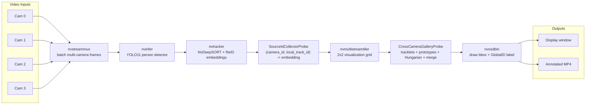

# Multi-Stream People Tracker

DeepStream 9.0 / pyservicemaker learning project for multi-camera people
detection, tracking, metadata extraction, and a ReID gallery prototype.

Default detector: **YOLO11n COCO** via `configs/models/nvinfer_yolov11_people.yml`.
Default tracker: **NvDeepSORT + Swin-Tiny ReID** via
`configs/tracker/nvdeepsort_reid_swin.yaml`.

---

## Docker Quick Start For Mentor

Use Docker first when reviewing the project on another machine. It avoids a
manual DeepStream Python setup and keeps the run command predictable.

### Host Requirements

| Requirement | Notes |
|-------------|-------|
| NVIDIA driver | 590+ recommended for DeepStream 9.0 |
| Docker | with NVIDIA Container Toolkit |
| NGC access | `docker login nvcr.io` may be needed to pull DeepStream |
| Desktop display | X11 socket is mounted for `nveglglessink` |

Quick GPU runtime check:

```bash
docker run --rm --gpus all nvidia/cuda:13.0.0-base-ubuntu24.04 nvidia-smi
```

### One-Time Setup

```bash
git clone <repo-url>
cd multi_stream_people_tracker

# If the DeepStream image is not already available:
docker login nvcr.io
# Username: $oauthtoken
# Password: <NGC API key>

# Allow container windows to open on the host X display.
xhost +local:docker

# Prepare the default YOLO11 detector and Swin-Tiny ReID model if missing.
./scripts/prepare_models.sh
```

`prepare_models.sh` uses Docker and internet access to export a dynamic-batch
YOLO11n ONNX file from Ultralytics when `models/yolov11/yolo11n.onnx` is
missing. It also downloads the Swin-Tiny ReID ONNX used by the default
NvDeepSORT tracker. It writes into `./models`, so Docker must be allowed to
bind mount this project directory. On Docker Desktop, add the project path
under Resources -> File Sharing if the script reports a mount/shared-path
error.

Prepare videos:

```bash
# Put or point videos in one host folder, then edit the Docker source list.
nano configs/sources/video_files_docker.txt
```

Inside `configs/sources/video_files_docker.txt`, paths must use `/videos/...`:

```text
/videos/cam1.mp4
/videos/cam2.mp4
/videos/cam3.mp4
/videos/cam4.mp4
```

### Smoke Test

```bash
VIDEO_DIR=/absolute/path/to/video/folder ./scripts/docker_smoke_test.sh
```

For build plus container import test:

```bash
VIDEO_DIR=/absolute/path/to/video/folder ./scripts/docker_smoke_test.sh --all
```

Expected signs:

- host GPU is printed by `nvidia-smi`
- required model/config files are `OK`
- `docker compose config` is `OK`
- with `--all`, container prints `person_class_id= 0`

If `--all` fails at the container import step with a GPU/CDI/runtime error,
fix NVIDIA Container Toolkit first. The default `docker compose up` command
also needs working Docker GPU access.

### Run The Demo

```bash
VIDEO_DIR=/absolute/path/to/video/folder docker compose up
```

The default Compose command runs:

```bash
python3 -m src.main \
  --sources configs/sources/video_files_docker.txt
```

Run a different milestone:

```bash
VIDEO_DIR=/absolute/path/to/video/folder docker compose run --rm tracker \
  python3 milestones/03_people_detection.py \
  --sources configs/sources/video_files_docker.txt
```

Restore X11 policy when done:

```bash
xhost -local:docker
```

### TensorRT Engine Behavior

The first run on a new GPU builds TensorRT `.engine` files. This is normal and
can take 1-3 minutes. Engines are saved next to their model files because
`docker-compose.yml` mounts `./models:/app/models`.

Examples:

```text
models/yolov8/yolov8n.onnx_b4_gpu0_fp16.engine
models/yolov11/yolo11n.onnx_b4_gpu0_fp16.engine
models/trafficcamnet/resnet18_trafficcamnet_pruned.onnx_b4_gpu0_fp16.engine
models/peoplenet/resnet34_peoplenet.onnx_b4_gpu0_fp16.engine
models/reid/resnet50_market1501.etlt_b16_gpu0_fp16.engine
```

Do not commit `.engine` files. They are GPU/driver/TensorRT specific and are
ignored by `.gitignore` and `.dockerignore`.

Model source files such as `models/yolov11/yolo11n.onnx`,
`models/yolov8/yolov8n.onnx`, and
`models/reid/resnet50_market1501.etlt` are also ignored to keep git history
small. Use `./scripts/prepare_models.sh` after cloning if they are missing.

---

## Demo Videos

Demo videos are hosted on YouTube so cloning the repository stays lightweight.

| ReID demo | 12-camera MTMC demo |
|-----------|---------------------|
| [](https://www.youtube.com/watch?v=ZMOqdWteNcw) | [](https://www.youtube.com/watch?v=W1TMZ4Rz2o8) |
| [Watch on YouTube](https://www.youtube.com/watch?v=ZMOqdWteNcw) | [Watch on YouTube](https://www.youtube.com/watch?v=W1TMZ4Rz2o8) |

---

## Current Pipeline Overview

The main multi-camera flow is shown below. GitHub renders this Mermaid diagram
directly in the README.



- `nvstreammux` batches frames from all camera videos.
- `nvinfer` runs YOLO11 person detection from
  `configs/models/nvinfer_yolov11_people.yml`.
- `nvtracker` assigns per-camera local track IDs. With
  `configs/tracker/nvdeepsort_reid.yaml`, it also produces ReID embeddings.
- `SourceIdCollectorProbe` runs before tiling, where `source_id` is reliable,
  and stores `(camera_id, local_track_id) -> embedding`.
- `nvmultistreamtiler` combines all streams into one grid for visualization.
- `CrossCameraGalleryProbe` links local track IDs into cross-camera Global IDs.
  The production entrypoint `python -m src.main` uses:
  tracklet embedding averaging, gallery prototypes, one-to-one assignment,
  ID stickiness, ambiguity rejection, and bounded online Global ID merging.
- `nvosdbin` draws the final labels, for example
  `Global:3`.

### ReID Stabilization Methods

`src/reid/gallery.py` contains the current cross-camera ReID logic used by
`python -m src.main`. The extra logic is there to handle common failure modes
in MTMC tracking:

| Method | Problem it solves | Key controls |
|--------|-------------------|--------------|
| Tracklet embedding | Single-frame ReID crops are noisy, especially during occlusion or bbox jitter. | `--tracklet-window`, `--tracklet-min-embeddings` |
| Gallery prototypes | One person can look different from front/back/side cameras. Multiple vectors preserve different views. | `GALLERY_MAX_PROTOTYPES`, `PROTOTYPE_ADD_THRESHOLD` |
| Hungarian assignment | Multiple new tracks in one camera can otherwise choose the same Global ID. | `--disable-hungarian`, `--assignment-max-candidates` |
| Duplicate guard | A Global ID should not appear twice in the same stream at the same time. | `--allow-duplicate-gid-per-stream` |
| ID stickiness | Prevents labels from bouncing between two similar Global IDs, e.g. `G14 <-> G8`. | `--id-switch-margin`, `--disable-id-stickiness` |
| Ambiguity rejection | Avoids accepting a match when top-1 and top-2 similarities are too close. | `--match-ambiguity-margin`, `--allow-ambiguous-match` |
| Online Global ID merge | Fixes stable ID splits, e.g. one camera stays `G4` while the opposite camera becomes `G19`. | `--global-merge-threshold`, `--global-merge-interval` |
| Bounded candidate search | Prevents lag when many IDs have been created over a long video. | `--gallery-max-age`, `--assignment-max-candidates`, `--global-merge-max-candidates` |

Useful tuning examples:

```bash
# Default ReID/Hungarian run
python -m src.main

# Debug similarity decisions and merge events
python -m src.main --debug-similarity

# Lower CPU load on long videos with many temporary IDs
python -m src.main \
  --gallery-max-age 300 \
  --assignment-max-candidates 40 \
  --global-merge-interval 30 \
  --global-merge-max-candidates 20

# A/B test without online ID merge
python -m src.main --disable-global-merge
```

Useful ReID commands:

```bash
python -m src.main

python -m src.main \
  --save-video output/videos/m8_hungarian_tracklet.mp4 \
  --no-display

python -m src.main \
  --debug-similarity \
  --tracklet-window 16 \
  --tracklet-min-embeddings 8
```

Use `--disable-tracklet`, `--disable-id-stickiness`,
`--allow-ambiguous-match`, `--disable-global-merge`, or
`--allow-duplicate-gid-per-stream` for A/B tests against simpler behavior.

---

## Local DeepStream Quick Start

Use this path if DeepStream 9.0 is installed directly on the host.

```bash
cd multi_stream_people_tracker

chmod +x setup_venv.sh
./setup_venv.sh
source venv/bin/activate

nano configs/sources/video_files.txt

python -m src.main
python -m src.main --debug-similarity
```

Local prerequisites:

| Requirement | Version |
|-------------|---------|
| Ubuntu | 24.04 |
| NVIDIA Driver | 590+ |
| CUDA | 13.1 |
| DeepStream | 9.0 |
| Python | 3.12 |
| TensorRT | 10.14 |

---

## Learning Path

Use the main app for the complete current system:

```bash
python -m src.main
```

Each milestone has visual output unless noted otherwise.

| # | Script | Output | Adds |
|---|--------|--------|------|
| 1 | `01_single_video_display.py` | Single video | `nvurisrcbin` + `nvstreammux` + sink |
| 2 | `02_multi_video_tiled.py` | Tiled videos | `nvmultistreamtiler` |
| 3 | `03_people_detection.py` | YOLOv8 boxes | `nvinfer` + `nvosdbin` |
| 4 | `04_people_tracking.py` | Track IDs | `nvtracker` + label probe |
| 5 | `05_multi_stream_tracking.py` | Full tiled tracker | multi-stream tracking |
| 6 | `06_batching_deep_dive.py` | Batch logs | mux/batch inspection |
| 7 | `07_metadata_extraction.py` | Stats + optional JSON | metadata traversal |
| 8 | `08_reid_stub.py` | Global-ID labels | NvDeepSORT/ReID gallery prototype |

Common local commands:

```bash
python milestones/01_single_video_display.py --input /path/to/video.mp4
python milestones/02_multi_video_tiled.py
python milestones/03_people_detection.py
python milestones/04_people_tracking.py
python milestones/04_people_tracking.py --tracker-config configs/tracker/iou.yaml
python milestones/05_multi_stream_tracking.py
python milestones/05_multi_stream_tracking.py --tile-w 640 --tile-h 360
python milestones/06_batching_deep_dive.py
python milestones/07_metadata_extraction.py --save-json
python milestones/08_reid_stub.py
python milestones/08_reid_stub.py --tracker-config configs/tracker/nvdcf_perf.yaml
```

---

## Source Configuration

Default source mode is `video_files`.

```yaml
source_mode: video_files

source_configs:
  video_files:  configs/sources/video_files.txt
  folder_input: configs/sources/folder_input.yaml
  rtsp_cameras: configs/sources/rtsp_cameras.txt
```

Source files:

- Local host run: edit `configs/sources/video_files.txt`
- Docker run: edit `configs/sources/video_files_docker.txt`
- Folder scan: edit `configs/sources/folder_input.yaml`
- RTSP cameras: edit `configs/sources/rtsp_cameras.txt`

---

## Detection Models

Switch model by changing `detection.config_file` in `configs/pipeline.yaml`,
or pass `--nvinfer-config` to any milestone from 03 onward.

| Model | Config | Person Class | Notes |
|-------|--------|--------------|-------|
| YOLO11n COCO | `configs/models/nvinfer_yolov11_people.yml` | 0 | default, dynamic ONNX, reuses YOLOv8 parser |
| YOLOv8n COCO | `configs/models/nvinfer_yolov8_people.yml` | 0 | stable baseline, dynamic ONNX, custom parser |
| TrafficCamNet | `configs/models/nvinfer_trafficcamnet.yml` | 2 | bundled-style detector |
| PeopleNet | `configs/models/nvinfer_peoplenet.yml` | 0 | person-focused TAO detector |

Milestones 04-08 infer the person class id from the selected label file, so
you do not need to edit Python constants when switching detectors.

YOLO11 details:

- ONNX: `models/yolov11/yolo11n.onnx`
- Parser: `models/yolov8/libnvds_infercustomparser_yolov8.so`
- Engine: `models/yolov11/yolo11n.onnx_b4_gpu0_fp16.engine`
- YOLO11 uses the same DeepStream parser path as YOLOv8 because the exported
  tensor layout is compatible.

YOLOv8 fallback details:

- ONNX: `models/yolov8/yolov8n.onnx`
- Parser: `models/yolov8/libnvds_infercustomparser_yolov8.so`
- Engine: `models/yolov8/yolov8n.onnx_b4_gpu0_fp16.engine`
- The ONNX must be exported with dynamic batch. Static batch-1 exports only
  produce detections for one frame in a DeepStream batch.

PeopleNet download:

```bash
bash scripts/download_peoplenet.sh
```

---

## Trackers

Switch tracker by changing `tracker.config_file` in `configs/pipeline.yaml`,
or pass `--tracker-config`.

| Tracker | Config | Use |
|---------|--------|-----|
| IoU | `configs/tracker/iou.yaml` | simplest baseline |
| NvDCF perf | `configs/tracker/nvdcf_perf.yaml` | fast GPU tracker, no ReID embeddings |
| NvDCF accuracy | `configs/tracker/nvdcf_accuracy.yaml` | better ID stability |
| NvDeepSORT ResNet50 | `configs/tracker/nvdeepsort_reid.yaml` | ReID experiments |
| NvDeepSORT Swin-Tiny | `configs/tracker/nvdeepsort_reid_swin.yaml` | main default ReID tracker |

---

## Project Layout

```text
multi_stream_people_tracker/
├── configs/
│   ├── pipeline.yaml
│   ├── sources/
│   │   ├── video_files.txt
│   │   ├── video_files_docker.txt
│   │   ├── folder_input.yaml
│   │   └── rtsp_cameras.txt
│   ├── models/
│   │   ├── nvinfer_yolov8_people.yml
│   │   ├── nvinfer_yolov11_people.yml
│   │   ├── nvinfer_trafficcamnet.yml
│   │   └── nvinfer_peoplenet.yml
│   ├── tracker/
│   │   ├── iou.yaml
│   │   ├── nvdcf_perf.yaml
│   │   ├── nvdcf_accuracy.yaml
│   │   ├── nvdeepsort_reid.yaml
│   │   └── nvdeepsort_reid_swin.yaml
│   └── labels/
├── models/
│   ├── yolov8/
│   ├── yolov11/
│   ├── trafficcamnet/
│   ├── peoplenet/
│   └── reid/
├── milestones/
├── src/
│   ├── main.py
│   ├── pipeline/
│   │   ├── engine_prep.py
│   │   ├── recording.py
│   │   └── sources.py
│   └── reid/
│       └── gallery.py
├── scripts/
├── reid_pipeline.py
├── Dockerfile
├── docker-compose.yml
├── LEARNING_NOTES.md
└── README.md
```

---

## Troubleshooting

### Docker Cannot Pull DeepStream

Run:

```bash
docker login nvcr.io
```

Use username `$oauthtoken` and an NGC API key as password.

### Docker Window Does Not Open

Check:

```bash
echo $DISPLAY
xhost +local:docker
```

The Compose file mounts `/tmp/.X11-unix` and passes `DISPLAY`.

If your Docker setup cannot share `/tmp/.X11-unix`, override the mount source:

```bash
X11_SOCKET_DIR=/path/shared/with/docker docker compose up
```

### Docker Cannot Find Videos

Make sure host `VIDEO_DIR` points to the folder containing the files listed in
`configs/sources/video_files_docker.txt`.

Example:

```bash
VIDEO_DIR=/home/user/videos docker compose up
```

with:

```text
/videos/cam1.mp4
/videos/cam2.mp4
```

### First Run Is Slow

TensorRT is building `.engine` files. Subsequent runs are fast.

### `ModuleNotFoundError: pyservicemaker`

For local host runs:

```bash
source venv/bin/activate
./setup_venv.sh
```

Docker installs pyservicemaker inside the image.

### Metadata Iterator Error

`frame_meta.object_items` and `batch_meta.frame_items` are iterators.
Do not call `len()` directly; iterate to count.

### VRAM Pressure

Use smaller tiles or save without display:

```bash
python -m src.main --tile-w 640 --tile-h 360
python -m src.main --save-video output/videos/reid.mp4 --no-display
```

You can also increase `interval` in the nvinfer config to skip inference frames.

---

## DeepStream 9.0 Paths

```text
Base:        /opt/nvidia/deepstream/deepstream-9.0/
Tracker lib: /opt/nvidia/deepstream/deepstream-9.0/lib/libnvds_nvmultiobjecttracker.so
PSM wheel:   /opt/nvidia/deepstream/deepstream-9.0/service-maker/python/pyservicemaker*.whl
```

Config file paths inside nvinfer YAML are relative to the config file's
directory, not the shell working directory.
