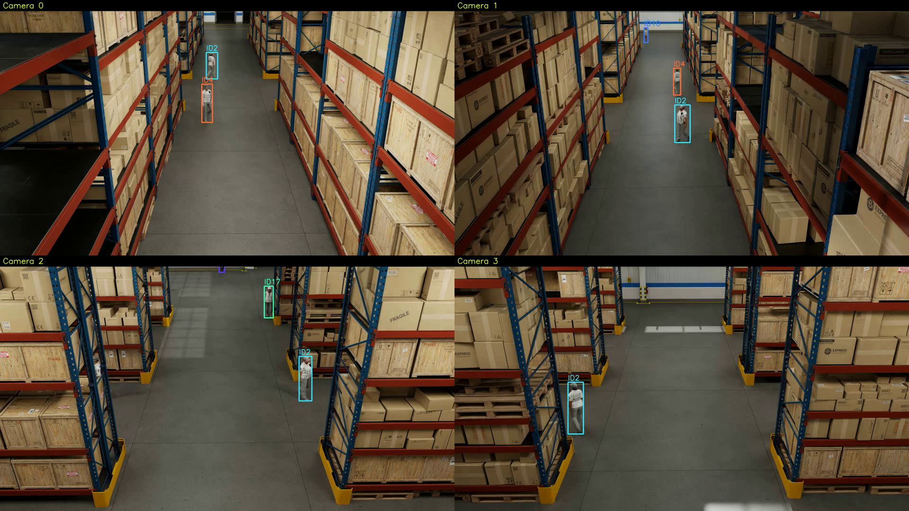
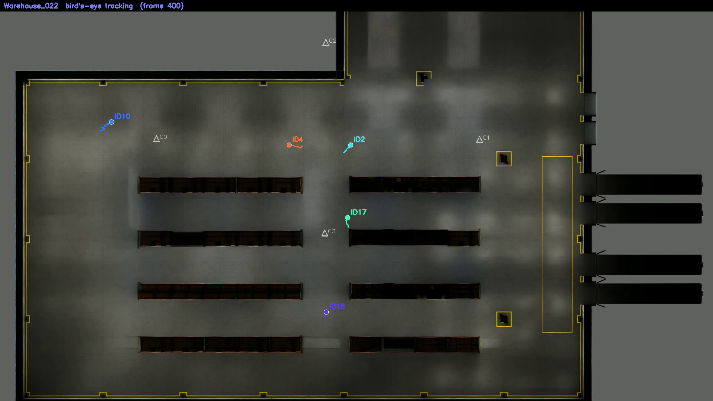
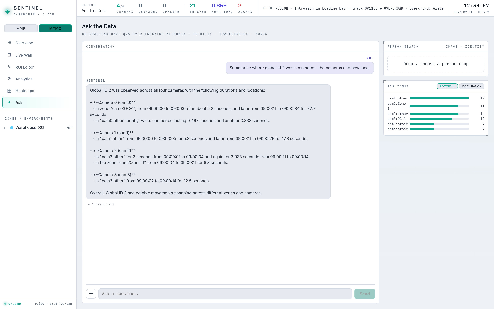

# Báo cáo ngày 01/07/2026
## Tầng hỏi–đáp RAG/Ask (gpt-4o) và ảnh chụp kết quả tốt nhất MTMC W022

## Đã làm
- Cho tầng RAG/Ask chạy với **OpenAI gpt-4o**: người dùng hỏi bằng ngôn ngữ tự nhiên, agent tự gọi các
  hàm truy vấn dữ liệu tracking rồi trả lời kèm số liệu.
- Chọn mô hình qua biến `RAG_MODEL`, nạp khóa API từ file `.env`.

## Cách triển khai
RAG = mô hình ngôn ngữ không tự bịa số, mà gọi hàm truy vấn dữ liệu thật rồi diễn giải. Gồm 3 phần:

1. **Kho dữ liệu (`ingest.py`).** Từ kết quả export của pipeline, dựng một file **SQLite** offline: mỗi
   phát hiện có mốc thời gian, điểm chân người, toạ độ thế giới, vùng ROI có tên; thêm bảng dẫn xuất
   `presence` / `dwell` / `zone_timeseries` và thư viện embedding theo từng `global_id`.
2. **Hàm truy vấn (`queries.py`, `api.py`).** 6 hàm cố định đọc SQLite trả về số liệu (bảng ở mục Kết
   quả). Mỗi hàm là một endpoint FastAPI, đã có unit-test — đây là phần "đúng đắn", không phụ thuộc LLM.
3. **Agent (`agent.py`).** gpt-4o đóng vai **bộ định tuyến**: đọc câu hỏi, chọn 1 trong 6 hàm, điền tham
   số (ví dụ ảnh → `global_id` qua tìm kiếm; "10 giờ sáng" → mốc ISO), chạy hàm, rồi viết câu trả lời từ
   kết quả. LLM chỉ điều phối, mọi số liệu đến từ hàm truy vấn.

Luồng `/ask`: câu hỏi → gpt-4o chọn hàm + tham số → chạy truy vấn SQLite/embedding → kết quả trả lại cho
gpt-4o → câu trả lời văn xuôi kèm vết `tool_calls` (hàm nào, tham số gì).

## Kết quả
Dựng kho dữ liệu từ cảnh `64pm_cafe_shop_1` (10 người, 142 985 phát hiện, 4 camera, 8 vùng).

6 hàm truy vấn chi tiết hoạt động, gpt-4o gọi được:

| Hàm | Trả lời |
|---|---|
| `top_zones` | Khu vực đông/được chú ý nhất |
| `zone_occupancy` | Mật độ một vùng theo thời gian |
| `person_timeline` | Một người xuất hiện khi nào, ở camera nào |
| `person_dwell` | Người đó ở mỗi vùng bao lâu |
| `person_trajectory_bev` | Quỹ đạo nhìn từ trên xuống |
| `search_person_by_image` | Tìm người từ ảnh cắt |

Ví dụ thực tế (gọi trên kho `64pm_cafe_shop_1`):

```
top_zones(occupancy, k=3)     → cam1:TABLE 2386,67 | cam2:TABLE 2359,0 | cam0:TABLE 1896,0 (người-giây)
top_zones(footfall, k=3)      → cam1:TABLE 89 | cam2:TABLE 88 | cam0:TABLE 79 (lượt người)
zone_occupancy(cam1:TABLE)    → bucket0 187,6s/8 người | bucket1 209,5s/7 | bucket2 209,7s/7 ... (mỗi bucket 30s)
person_timeline(gid=7)        → cam1:TABLE 354,7s | cam2:TABLE 354,7s | cam0:other 221,8s | cam3:other 73,7s
person_dwell(gid=7)           → cam1:TABLE 354,7s (1 lần) | cam2:TABLE 354,7s | cam0:other 350,3s | cam3:other 318,8s
person_trajectory_bev(gid=7)  → [ts, cam, world_x, world_y, zone] theo thời gian (đường đi nhìn từ trên xuống)
search_person_by_image(ảnh)   → nhúng ảnh cắt bằng Swin ONNX → global_id gần nhất → nối vào 3 hàm person_*
```

Web UI — hỏi bằng ngôn ngữ tự nhiên (gpt-4o): "which area got the most attention?" → agent gọi
`top_zones(occupancy)` → trả lời đúng **`cam1:TABLE` (2386,67 người-giây)** kèm vết công cụ đã dùng.


Web UI — hàm **tìm người từ ảnh**: tải một ảnh cắt người → ra danh sách `global_id` gần nhất (ID 8 73%,
ID 7 29%...) → chọn một ID → hiện thời gian lưu theo vùng, quỹ đạo và lịch xuất hiện.


`pytest tests/test_rag.py` → **12/12 pass**.

## MTMC W022 — kết quả tốt nhất (Global IDF1 0,856)
Chạy lại global linker (gom cụm tương quan có ràng buộc) trên export W022 @1280 → **Global IDF1 0,8562**
(25 ID dự đoán / 17 ID thật; TP 16398, FP 1530, FN 3977) = **92% trần oracle 0,932**.

Ảnh chụp từ chính kết quả này: cùng một người giữ **một global ID xuyên 4 camera** (ID2), và vị trí
nhìn từ trên xuống trên mặt sàn kho (chấm màu + đuôi quỹ đạo + vị trí camera C0–C3).





Chạy tầng **RAG/Ask ngay trên kết quả W022 này**: dựng kho SQLite từ các global ID đã liên kết + hiệu
chỉnh metric (foot→world) + vùng nvdsanalytics. Hỏi "global id 2 xuất hiện ở đâu, bao lâu" → gpt-4o trả
lời đúng: người 2 đi xuyên **cả 4 camera** (cam0:OC-1, cam2:Zone-1, ...). Cần thêm một nhánh ingest MTMC
(dùng assign của global linker, calib metric, embedding theo từng phát hiện).



## Còn lại
- Text-to-SQL dự phòng cho câu hỏi mở.
- Tìm kiếm theo ảnh kém nhất ở retail (IDF1 0,661).
- Hiện chạy trên dữ liệu đã ghi, chưa trực tuyến.
