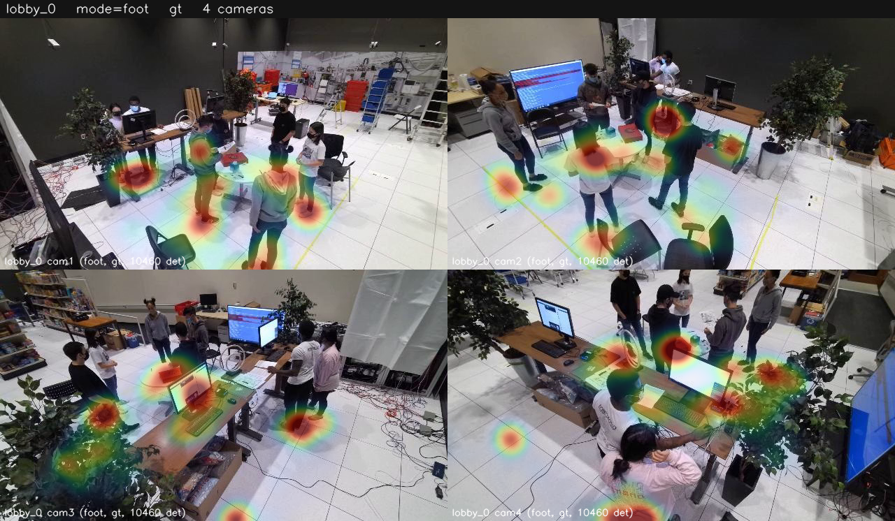
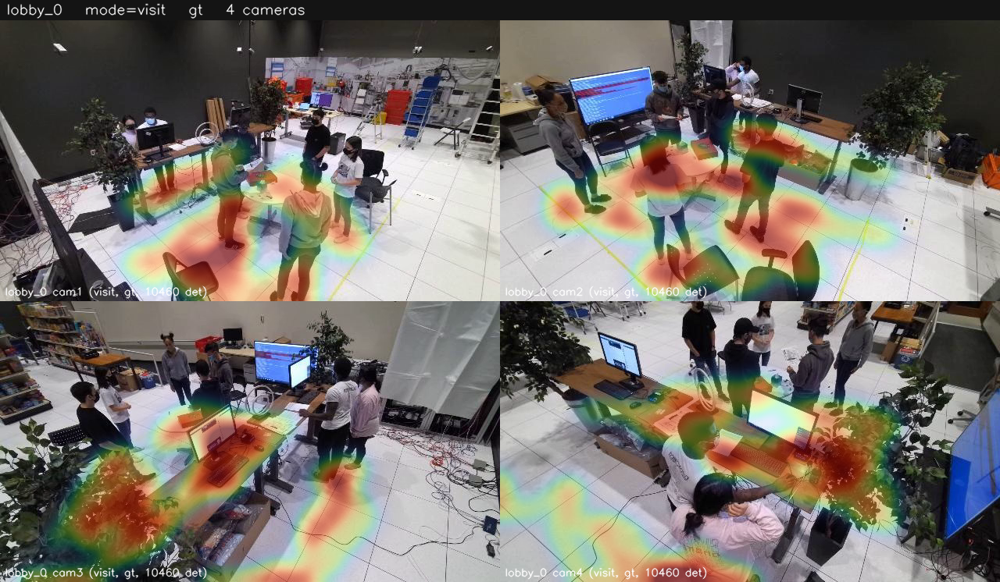
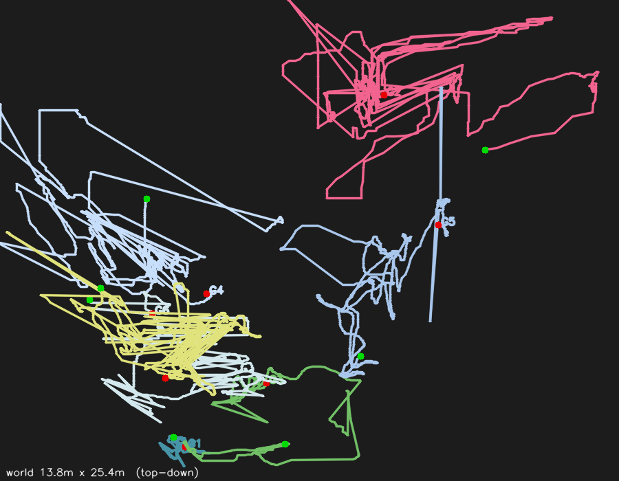
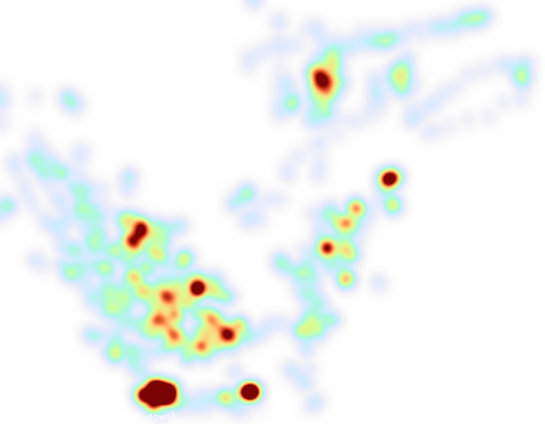

# Báo cáo 12/06/2026 — Vấn đề nhãn ID MMPTracking, Heatmap per-camera, Global-ID analytics

Hardware: RTX 5060 Ti 16 GB, Ubuntu 24.04, DeepStream 9.0.

---

## 1. Vấn đề nhãn ID của MMPTracking và hệ quả với MMPTracking_10minute

### 1.1 Bản chất: `person_id` chỉ nhất quán trong PHẠM VI MỘT scene
MMPTracking đánh `person_id` **chỉ nhất quán xuyên camera trong một scene**; mỗi scene
đánh số lại từ đầu — **không phải global identity**. "28 người (14 train / 7 val / 7 test)"
trong mô tả dataset là số người THỰC tham gia quay, **không phải nhãn** trong annotation.

Đã xác nhận 3 cách (12/06):
- `build_mmp_10minute.py` đọc `person_id` thẳng từ JSON của **từng scene** (mỗi scene là
  một sequence độc lập) — không phải lỗi build.
- Test embedding với `swin_tiny_mmp_reid_all`: cùng scene khác camera = **6/7 đường chéo**
  (positive control đạt); **cùng môi trường khác scene** (lobby_0 vs lobby_1) = **0/7 đường
  chéo** nhưng off-diagonal cao 0.7–0.9 → **cùng người, id bị hoán vị**; khác môi trường = 1/7.
- Kiểm tra bằng mắt khung hình có bbox + id: cùng một người mang id khác nhau ở scene khác.

### 1.2 Vì sao MMPTracking_short ÍT bị ảnh hưởng
Crop cache gán identity theo `(scene, person_id)`. MMPTracking_short chỉ **~4 scene/môi
trường** → mỗi người thật bị tách thành ~4 nhãn → nhiễu **nhẹ**. Model deployed
(`swin_tiny_mmp_reid_all`, warm-start + train trên đúng scene triển khai) vẫn đạt **~0.80
Global IDF1**, nên vấn đề bị che lấp.

### 1.3 Vì sao MMPTracking_10minute bị OVERFIT
MMPTracking_10minute có **~9–13 scene/môi trường** (3 phiên 63am/64am/64pm) → **196 nhãn
train cho ~28–50 người thật**. Hệ quả:
1. **Triplet loss nhiễu nặng** — bị ép đẩy XA chính cùng một người xuất hiện ở các scene
   khác nhau (vì chúng là nhãn khác nhau).
2. **Val = phiên 64pm** (identity tách biệt, chưa từng thấy) → đo generalization thật →
   model **overfit**: `val_gap` đạt đỉnh sớm (epoch ~3–6) rồi tụt dù `train acc` vẫn tăng.

→ **Nghịch lý**: nhiều dữ liệu hơn (1M+ crop) nhưng **nhãn nhiễu hơn** → ReID 10min **kém
hơn** model deployed (đã đo: thấp hơn cả trên val held-out lẫn benchmark MMPTracking_short).

### 1.4 Hướng xử lý: GIỮ NGUYÊN cách làm như MMPTracking_short
Mục tiêu: train/eval 10minute **giống hệt short** (warm-start, scene-split, train trên
scene triển khai) + **sửa nhãn identity về đúng**. Đã xây bộ công cụ gán nhãn lại:
- `consolidate_reid_identities.py` — auto-cluster theo appearance + ràng buộc cannot-link.
- `reid_label_app.py` — **web app gán nhãn thủ công** (click crop → gom nhóm người); portable
  (chỉ cần dataset, crop on-the-fly, không cần crop cache / `output/`); imgs/track tới 50.
- `apply_reid_labels.py` — biến nhãn thủ công → **cache train sạch**.

**Kết quả**: 196 nhãn scene-local → **56 identity đã kiểm chứng** (14 người/môi trường × 4
môi trường), khớp với mô tả dataset (14 train people). Đang retrain ReID warm-start trên
56 identity SẠCH này (lần đầu train trên nhãn ĐÚNG).

> Lưu ý kỹ thuật: lần train này từng chậm (~19 s/batch) — nguyên nhân là **OS page cache
> nguội** (crop cache 7.3 GB / 1M file bị đẩy khỏi RAM bởi các job I/O xen giữa), KHÔNG phải
> do thuật toán. Warm cache 1 lần (đọc tuần tự vào RAM) → trở lại ~1.5 s/batch như trước.

---

## 2. Heatmap phân tích theo TỪNG camera (per-camera) — `scripts/eval/camera_heatmap.py`

Tích lũy vị trí người qua toàn clip → bản đồ mật độ, phủ lên đúng khung hình của từng camera.

- **3 chế độ**: `foot` (mật độ chỗ đứng — foot point), `dwell` (phủ toàn thân / thời gian
  lưu lại), `visit` (di chuyển/coverage — mỗi track tính 1 lần/ô, **độc lập thời gian đứng yên**).
- **Nguồn**: GT (mặc định) hoặc pipeline (`--pred-dir`).
- **Đánh giá chất lượng** (`--compare-gt`): dựng GT | PRED | DIFF và in **CC / SIM / KL**.
  lobby_0: **CC ≈ 0.97–0.99** (heatmap từ pipeline trung thực với GT).
- **Group montage**: gộp tất cả camera của một scene vào một ảnh.

Group heatmap (foot, GT) — 4 camera lobby_0 trong một ảnh:

Kiểm chứng chất lượng GT | PRED | DIFF (foot, lobby_0) — cột DIFF gần như trống = pipeline khớp GT:

Chế độ `visit` (di chuyển/coverage) — rộng hơn `foot`, làm nổi lối đi thay vì chỗ đứng yên:

**Liên kết — `nvdsanalytics` (pipeline-native, ĐẾM)**: đã wire `gst-nvdsanalytics`
(`--nvdsanalytics-config`): ROI occupancy, line-crossing, overcrowding — đếm trực tiếp trong
pipeline, in ra + xuất `analytics.csv` + vẽ lên video. Bổ sung cho heatmap: **heatmap = mật
độ (ở đâu)**, **nvdsanalytics = đếm theo vùng (bao nhiêu / vượt ngưỡng / qua vạch)**.

---

## 3. Global ID: ĐÃ implement, CHƯA test thật

### 3.1 Vấn đề: Global ID bùng nổ theo thời gian
Video dài: người rời đi/quay lại, hoặc bị tách giữa các camera → gallery cấp ID mới → N
người thật phình thành rất nhiều ID. Online merge càng tệ (7→231 ID); nearline cửa sổ 125f
không nối được khoảng trống dài hàng phút.

### 3.2 Đã implement (chain: stabilize → save → analyze)
- **`src/eval/reid_reentry_merge.py`** — hợp nhất toàn chuỗi: gộp 2 global ID nếu *(cosine
  embedding ≥ ngưỡng)* **VÀ** *(không bao giờ chung `(camera, frame)`)* — 1 detection/camera
  ⇒ chung cam-frame = hai người khác nhau. Xử lý cả **re-entry** lẫn **cross-camera**; an toàn.
  Unit test PASS. *(Trên MMP hiện là no-op: scene luôn đông đủ — không có re-entry — và có
  người giống nhau (look-alike) → đúng/an toàn nhưng chưa có gì để gộp.)*
- **`scripts/eval/global_tracks.py`** — **LƯU** global ID thành kho quỹ đạo: `global_tracks.csv`
  (điểm thế giới mỗi `(global_id, frame)`), `global_id_summary.csv` (dwell, quãng đường, tốc
  độ, span, số camera). Có hợp nhất multi-cam (median) + lọc outlier IQR + làm mượt.
- **`scripts/eval/trajectory_analytics.py`** — phân tích: **journey map**, **dwell heatmap**,
  **OD matrix** (luồng giữa các vùng), **time-in-zone**.

Journey map (quỹ đạo từng global ID, không gian thế giới top-down) và Dwell heatmap (thời gian
lưu lại) — lobby_0:

### 3.3 Chưa test + ghi chú thực tế
- **Real testing hoãn** đến khi ReID (nhãn sạch) ổn định — ID có ổn định thì phân tích
  per-identity mới có nghĩa (ID phân mảnh → mọi thống kê per-person đều rác).
- **Thực tế production** sẽ lưu vào **database** (Kafka → Elasticsearch / time-series DB,
  query-by-ID theo thời gian dài) như kiến trúc Metropolis MTMC/RTLS. CSV ở đây là **bản
  offline tương đương** (cùng schema, nạp DB dễ dàng); bước SQLite hoá là tùy chọn tiếp theo.

---

## 4. Tổng kết
- ✅ **Chẩn đoán nhãn ID**: `person_id` scene-local → 10min phân mảnh nặng (196 nhãn/~50 người)
  → triplet nhiễu + overfit trên val unseen. Short ít bị do chỉ ~4 scene/môi trường.
- ✅ **Bộ công cụ relabel** (consolidate + web app + apply) → **56 identity sạch**; đang retrain
  warm-start như cách MMPTracking_short.
- ✅ **Heatmap per-camera** (foot/dwell/visit, GT/pred, compare CC≈0.98, group montage) +
  nvdsanalytics đếm theo vùng — đã xong, đã kiểm chứng.
- ⏳ **Global-ID** (reentry-merge + trajectory store + analytics) — đã implement & verify logic;
  **chờ ReID ổn định để test thật** trên video dài.
