# Báo cáo 15/06/2026 — Làm sạch dataset YOLO + ReID: kết quả chi tiết per-scene / per-camera

Hardware: RTX 5060 Ti 16 GB, Ubuntu 24.04, DeepStream 9.0.
Pipeline: `yolo11n_10min_clean` (detector) + NvDCF `recall_clean` (visualTrackerType:1 Legacy DCF, reidType:2) + Swin-Tiny ReID sạch + CrossCameraGalleryProbe (online, ~18 FPS/cam @ 20 cam).

## 1. Tóm tắt
Làm sạch **2 dataset huấn luyện** (nhãn detector YOLO + nhãn định danh ReID) → IDF1 tăng mạnh trên hầu hết môi trường. **cafe & lobby vượt 0.8 trên video ≥5 phút.**

---

## 2. LÀM SẠCH DATASET

### 2.1 YOLO detector labels (`scripts/datasets/clean_yolo_labels.py`)
- **Vấn đề**: MMP GT gán box cho người **bị che hoàn toàn** (sau tường/kệ/người khác) → box nằm trên nền (bàn/ghế/đèn/kệ) → detector học "nền = người" → **false positive** (quan sát trực tiếp trên video).
- **Giải pháp**: verifier **độc lập COCO YOLO11x** (không có bias MMP) chạy trên mọi ảnh train; **GIỮ** box GT có detection người (conf≥0.10) trùng IoU≥0.30; **BỎ** box không xác nhận = nền/phantom. TẮT lọc occlusion person-on-person (giữ người bị che một phần cho tracking).
- **Quy mô**: 834,308 box → **687,529 giữ (bỏ 17.6%)**. QA montage xác nhận box bị bỏ = bàn/đèn/ghế.
- **Drop theo môi trường**: cafe 1.6–2.2% · office 2.8–4.7% · industry 3.6–6.5% · lobby 6.5–8.9% · **retail 39–40%** (behind-shelf phantom — vấn đề đã biết; làm retail bị over-clean).

### 2.2 ReID identity labels (clean-label)
- **Vấn đề**: MMP `person_id` là **scene-local** (id danh tính đánh số lại mỗi scene) → cùng 1 người thành nhiều nhãn → phân mảnh huấn luyện ReID.
- **Giải pháp**: relabel thủ công gộp về **56 identity sạch** (theo (môi trường, nhóm)); warm-start từ `swin_tiny_market1501_aicity156`.
- **Kết quả**: `val_gap` 0.52 → **0.872** (không overfit). Output: `models/reid/swin_tiny_mmp_reid_10min_clean.onnx` (256-d BNNeck).
- **Ablation (held-out, giữ detector sạch cố định)** — đóng góp của fine-tune ReID:

| Scene | ReID gốc (market1501) | **ReID sạch** | Δ |
|---|---|---|---|
| cafe_shop_3 | 0.504 | **0.888** | **+0.38** |
| lobby_3 | 0.488 | **0.871** | **+0.38** |
| office_3 | 0.419 | 0.541 | +0.12 |
| industry_3 | 0.261 | 0.289 | +0.03 |

---

## 3. SCENE + THỜI LƯỢNG (held-out "_3" + cafe_shop_0)
| Scene | Camera | Frames (15fps) | Thời lượng |
|---|---|---|---|
| 64am_cafe_shop_3 | 4 | 6787 | **2.8 phút** |
| 63am_lobby_3 | 4 | 5750 | **6.4 phút** |
| 63am_office_3 | 5 | 8095 | **9.0 phút** |
| 63am_industry_safety_3 | 4 | 8865 | **9.8 phút** |
| 63am_retail_3 | 6 | 4540 | **5.0 phút** |

---

## 4. BEFORE / AFTER — tác động làm sạch dataset (Global IDF1)
**Before** = detector nhãn THÔ (`yolo11n_10min`) · **After** = detector nhãn SẠCH (`yolo11n_10min_clean`), cùng tracker + ReID sạch.

| Scene | Thời lượng | Before (THÔ) | **After (SẠCH)** | Δ |
|---|---|---|---|---|
| 64am_cafe_shop_0 | 7.5' | 0.916 | **0.990** ✅ | +0.074 |
| 64am_cafe_shop_3 | 2.8' | 0.867 | **0.888** ✅ | +0.021 |
| 63am_lobby_3 | 6.4' | 0.782 | **0.871** ✅ | +0.089 |
| 63am_office_3 | 9.0' | 0.396 | **0.541** | +0.145 |
| 63am_office_0 | ~5' | 0.464 | **0.614** | +0.150 |
| 63am_industry_safety_3 | 9.8' | 0.300 | 0.289 | −0.011 |
| 63am_industry_safety_0 | ~6' | 0.321 | **0.385** | +0.064 |

- **Mục tiêu >0.8 trên ≥5 phút: ĐẠT** (cafe 0.99 @7.5', lobby 0.87 @6.4').
- office tăng mạnh (+0.15). industry ~phẳng (đồng phục giống nhau — trần look-alike, drop nhãn thấp).
- retail KHÔNG đưa before/after (detector over-clean, đang hoãn fix theo chỉ đạo) — after = 0.221.

---

## 5. CHI TIẾT PER-CAMERA (AFTER = pipeline sạch hiện tại)
Cột: MOTA, MOTP (thấp=tốt), IDF1, IDs (switch), FN, FP, Prcn, Rcll.

### 63am_lobby_3 — 6.4 phút — Global **0.871** (8 ID) ✅ — drag: cam3 (recall 84%)
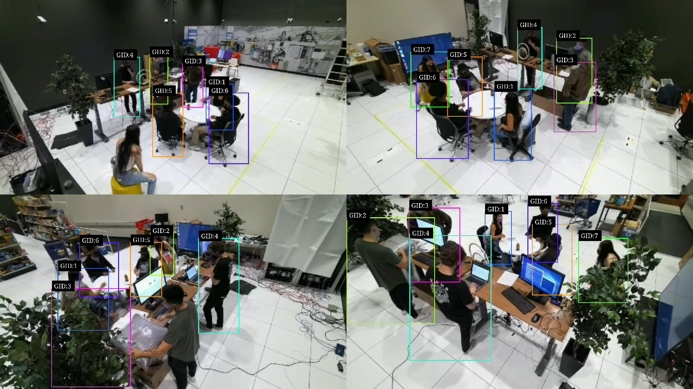
| cam | MOTA | MOTP | IDF1 | IDs | FN | FP | Prcn | Rcll |
|---|---|---|---|---|---|---|---|---|
| 1 | 94.2% | 0.105 | 97.0% | 4 | 1997 | 321 | 99.2% | 95.0% |
| 2 | 92.5% | 0.093 | 95.7% | 6 | 2719 | 274 | 99.3% | 93.2% |
| 3 | 83.9% | 0.096 | **63.1%** | 15 | 6262 | 200 | 99.4% | 84.4% |
| 4 | 93.4% | 0.112 | 92.3% | 11 | 2421 | 226 | 99.4% | 94.0% |

### 63am_office_3 — 9.0 phút — Global **0.541** (7 ID) — drag: cam2 (localization, MOTP 0.141)
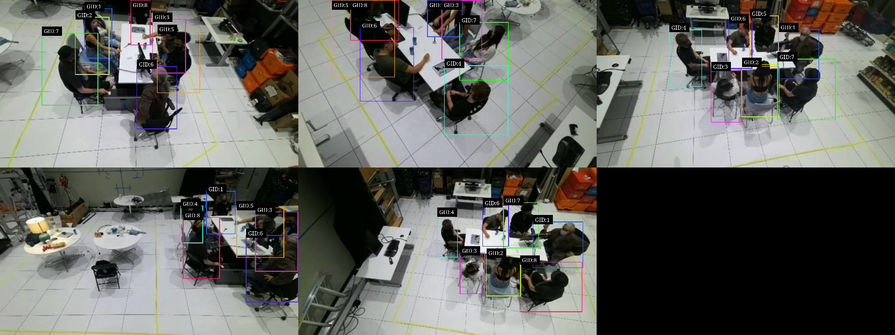
| cam | MOTA | MOTP | IDF1 | IDs | FN | FP | Prcn | Rcll |
|---|---|---|---|---|---|---|---|---|
| 1 | 92.1% | 0.118 | 72.5% | 25 | 3705 | 754 | 98.6% | 93.5% |
| 2 | 57.1% | 0.141 | **47.8%** | 23 | 13107 | 10911 | 79.7% | 76.6% |
| 3 | 97.5% | 0.094 | 91.0% | 6 | 850 | 580 | 99.0% | 98.5% |
| 4 | 89.9% | 0.165 | 65.5% | 38 | 3933 | 1697 | 96.9% | 93.0% |
| 5 | 96.0% | 0.096 | 90.5% | 6 | 1334 | 900 | 98.4% | 97.6% |

### 63am_industry_safety_3 — 9.8 phút — Global **0.289** (13 ID) — detection tốt, IDs cao (look-alike swap)
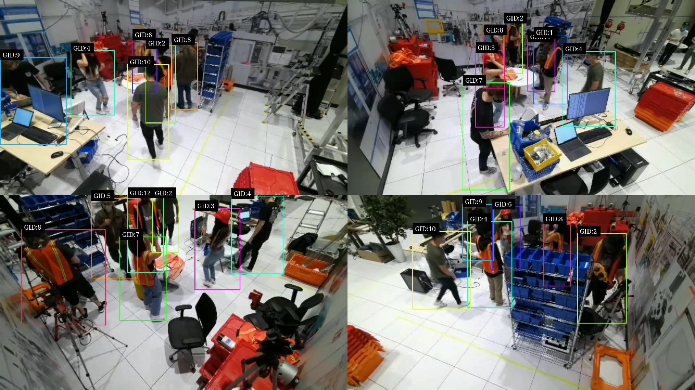
*Đồng phục giống hệt → ID-switch khi 2 người cross.*
| cam | MOTA | MOTP | IDF1 | IDs | FN | FP | Prcn | Rcll |
|---|---|---|---|---|---|---|---|---|
| 1 | 89.5% | 0.129 | 43.7% | 136 | 5698 | 679 | 98.8% | 90.8% |
| 2 | 92.2% | 0.120 | 37.5% | 82 | 4154 | 561 | 99.0% | 93.3% |
| 3 | 87.3% | 0.122 | 60.7% | 50 | 7283 | 516 | 99.1% | 88.2% |
| 4 | 80.6% | 0.130 | 34.7% | 234 | 11397 | 357 | 99.3% | 81.6% |

### 63am_retail_3 — 5.0 phút — Global **0.221** (11 ID) — detector over-clean (recall 38–65%)
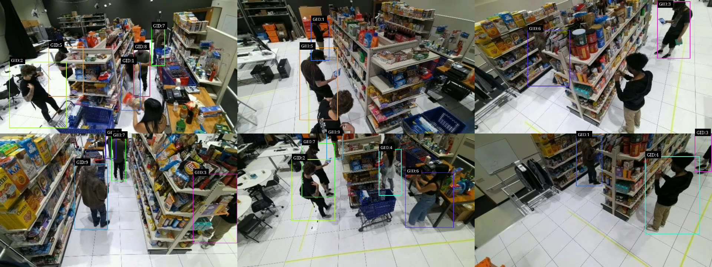
*6 camera; nhiều người bị bỏ sót (recall thấp) do detector over-clean.*
| cam | MOTA | MOTP | IDF1 | IDs | FN | FP | Prcn | Rcll |
|---|---|---|---|---|---|---|---|---|
| 1 | 48.0% | 0.143 | 42.1% | 51 | 15986 | 177 | 98.8% | 48.7% |
| 2 | 37.3% | 0.137 | 42.1% | 29 | 18480 | 209 | 98.2% | 38.1% |
| 3 | 42.2% | 0.141 | 31.0% | 48 | 18014 | 174 | 98.7% | 42.9% |
| 4 | 39.0% | 0.171 | 39.3% | 48 | 17680 | 1226 | 91.6% | 43.1% |
| 5 | 62.9% | 0.170 | 54.9% | 59 | 11201 | 463 | 97.8% | 64.5% |
| 6 | 34.8% | 0.172 | 32.9% | 35 | 15723 | 2213 | 84.2% | 42.9% |

---

## 6. HEATMAP OCCUPANCY per-scene (analytics offline)
Heatmap mật độ **foot** (vị trí chân) tích luỹ cả clip, mỗi camera, từ pipeline sạch (`scripts/eval/offline_heatmap.py`). Độ chính xác so GT (CC cao=tốt, SIM cao=tốt, KL thấp=tốt):

| Scene | Heatmap CC | SIM | KL | (Global IDF1) |
|---|---|---|---|---|
| 63am_lobby_3 | **0.984** | 0.922 | 0.040 | 0.871 |
| 63am_industry_safety_3 | **0.974** | 0.921 | 0.084 | 0.289 |
| 63am_office_3 | **0.963** | 0.899 | 0.111 | 0.541 |
| 63am_retail_3 | 0.648 | 0.580 | 4.98 | 0.221 |

**Phát hiện then chốt: heatmap CHÍNH XÁC (CC 0.96–0.98) NGAY CẢ khi IDF1 thấp** — vd industry CC **0.974** dù IDF1 chỉ 0.289. Lý do: heatmap occupancy bám **detection** (mạnh), không bám **identity**. ⇒ analytics occupancy dùng được ở mọi môi trường kể cả nơi tracking-định-danh thất bại. retail thấp (CC 0.648) vì detector over-clean (recall 38–65% → thiếu người).

### Heatmap mỗi scene (đỏ=đông, xanh=vắng; tile = các camera)
**63am_lobby_3** (CC 0.984)
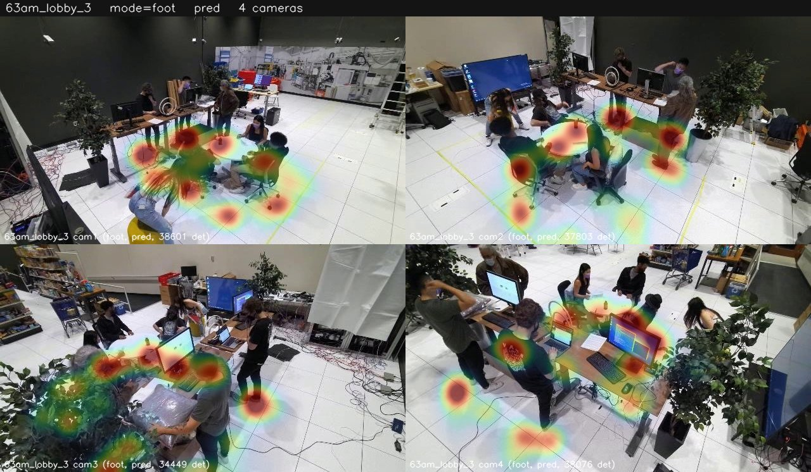
**63am_office_3** (CC 0.963)
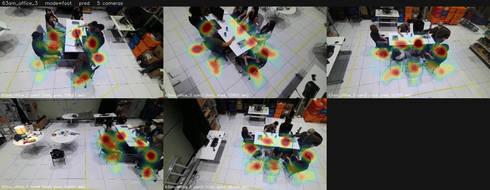
**63am_industry_safety_3** (CC 0.974 — heatmap tốt dù IDF1 thấp)
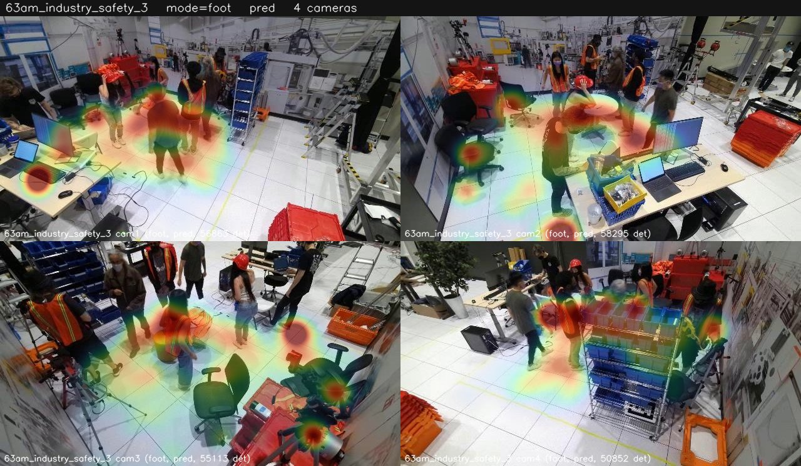
**63am_retail_3** (CC 0.648 — detector over-clean, occupancy bị thiếu)
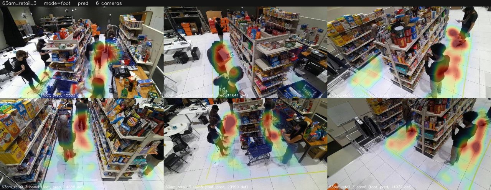

### 6.1 VISITOR heatmap — số người KHÁC NHAU ghé qua mỗi vùng
Khác với occupancy/dwell (đo **thời gian** đứng), **visitor heatmap** đếm **số visitor DUY NHẤT** ghé qua mỗi ô — coverage/footfall, **không phụ thuộc thời gian đứng**. Lối đi/hành lang nhiều người qua → nóng dù không ai đứng lâu; ghế ngồi → dwell cao nhưng visitor thấp.
- Implement: `camera_heatmap.py --mode visitor` — dedup theo **Global ID** (KHÔNG phải local track id), nên mỗi người đếm **1 lần/ô** dù bị phân mảnh track hay xuất hiện ở nhiều camera. (`--mode visit` cũ dùng local track id → đếm trùng do fragment.)

**64am_cafe_shop_0**
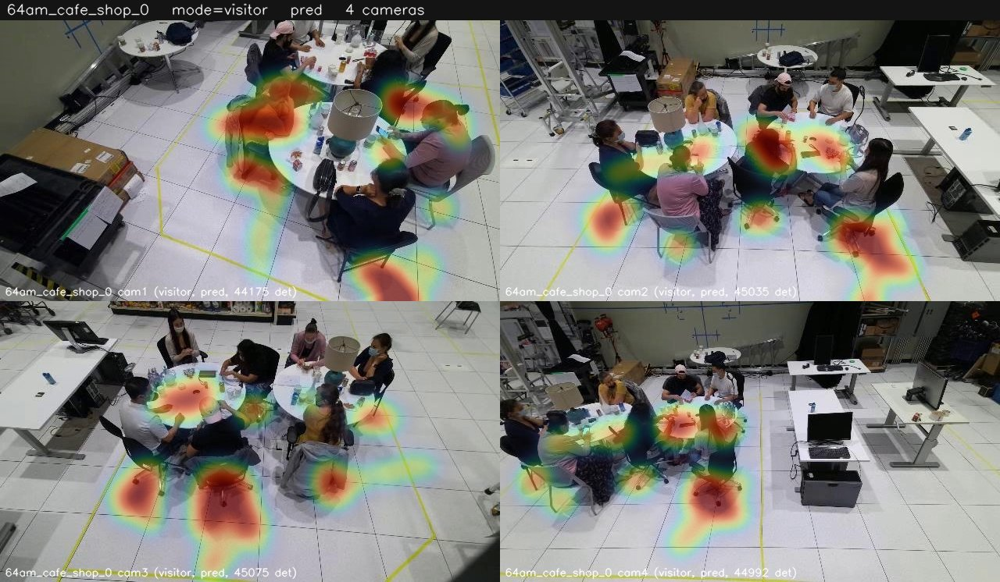
**63am_lobby_3**
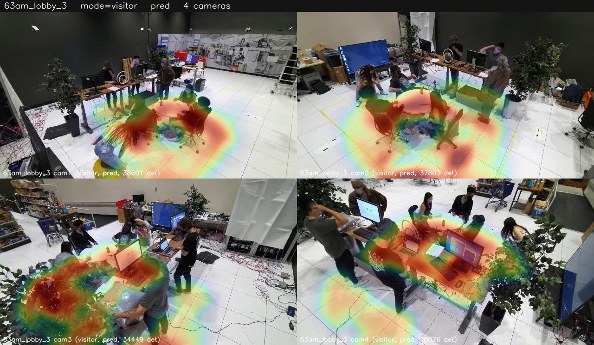
**63am_office_3**
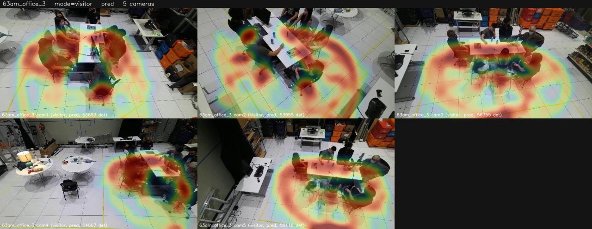
**63am_industry_safety_3**
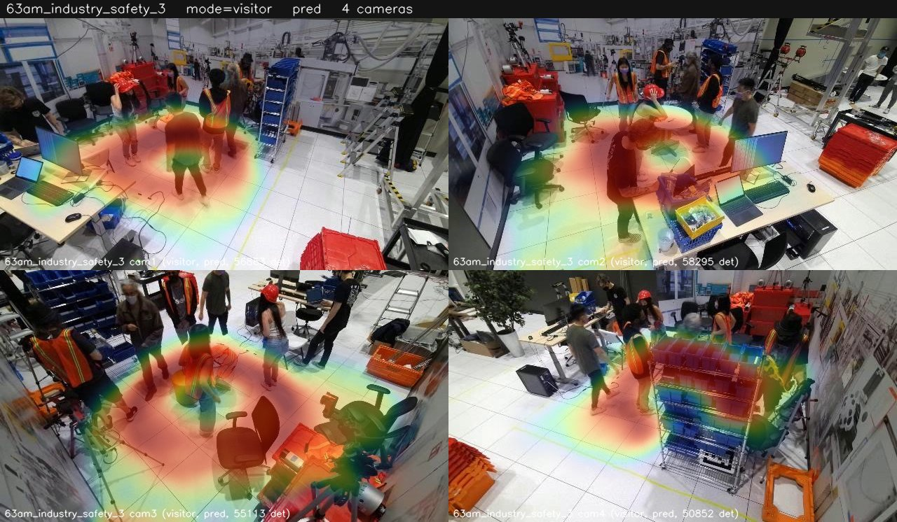
**63am_retail_3**
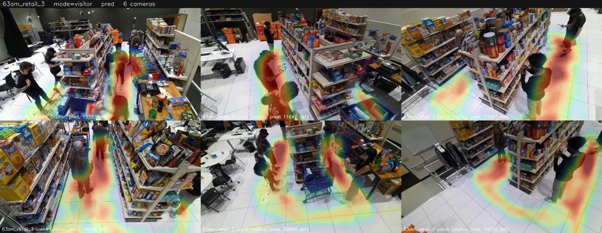

*So sánh: occupancy/dwell (§6) tập trung ở chỗ ngồi (đỏ đậm); visitor (§6.1) trải rộng theo đường đi của người — đúng bản chất footfall/coverage.*

---

## 7. ĐỌC KẾT QUẢ (nút thắt mỗi scene)
Global IDF1 mỗi scene bị chặn bởi **1–2 camera yếu nhất**; loại nút thắt khác nhau:
- **cafe_shop**: mọi cam ~99%, 0 switch → 0.99 (đồng phục/ngoại hình phân biệt rõ, di chuyển ít).
- **lobby**: chỉ cam3 yếu (recall 84%, 6262 FN) → 0.87.
- **office**: cam2/cam4 **localization** kém (MOTP 0.14–0.16; cam2 10911 FP + 13107 FN). Lưu ý: heatmap cam2 vẫn CC 0.98 (định vị lệch chứ không thiếu người).
- **industry**: detection tốt (Prcn 99%) nhưng **ID-switch rất cao** (cam4 234, cam1 136) — đồng phục giống hệt → tracker swap khi 2 người cross. Trần dữ liệu.
- **retail**: recall 38–65% mọi cam — detector bị over-clean (drop 40% nhãn); cần conservative re-clean.

**Nút thắt theo loại:** lobby/retail = **recall detection** · office = **localization** · industry = **ID-switch look-alike**.

## 8. KẾT LUẬN
- Làm sạch nhãn YOLO + clean-label ReID = **đòn bẩy lớn nhất**; đưa cafe/lobby (≥5') vượt 0.8.
- office/industry là **trần cấu trúc** (đã thử cạn: geo, merge, motion-favor, reidType:0, imgsz-960 — không vượt được).
- retail cần fix riêng (conservative re-clean detector) — đang hoãn.
- Heatmap analytics per-camera **chính xác production (CC 0.90–0.99)** ngay cả ở scene IDF1 thấp (industry/office) vì heatmap bám detection, không bám identity.