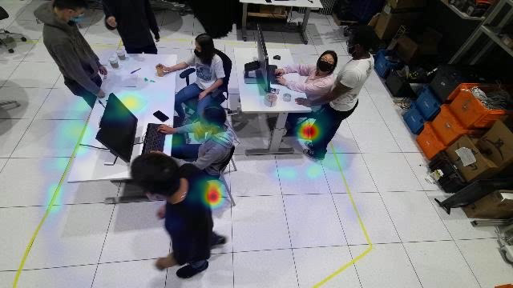
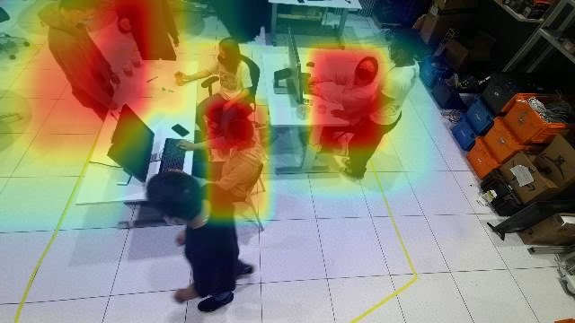
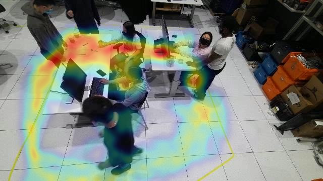
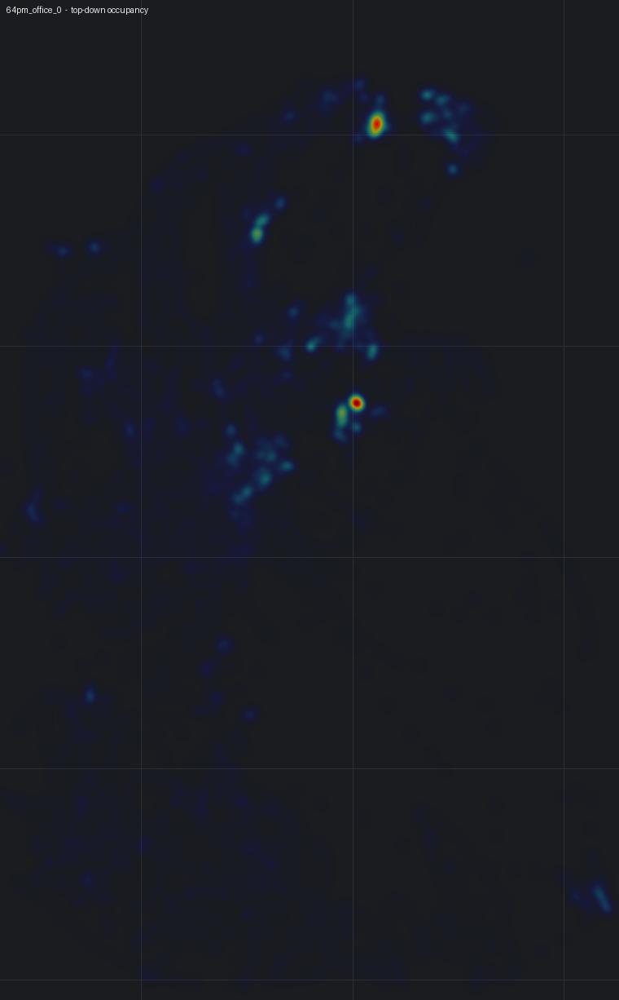

# Báo cáo ngày 22/06/2026
## Tình hình hệ thống theo dõi người đa camera — tracking, heatmap, video demo

**Phần cứng:** GPU NVIDIA RTX 5060 Ti (16 GB), Ubuntu 24.04, DeepStream 9.0.

---

## 1. Tổng quan hệ thống

Hệ thống theo dõi người qua nhiều camera, chạy thời gian thực, gồm hai tầng:

1. **Trong từng camera:** detector YOLO11 phát hiện người → tracker NvDCF gán *local track ID*
   (định danh nội bộ một camera) → trích đặc trưng ngoại hình (ReID) cho mỗi người.
2. **Cross camera:** gom các local ID của cùng một người ở các camera khác nhau thành **Global ID**
   (định danh toàn hệ thống), theo từng môi trường (mỗi môi trường = một cụm camera độc lập).

**Năng lực hiện tại:** 20 camera đồng thời, **~10–11 FPS/camera**, **độ chính xác định danh (Global
IDF1) ≈ 0.81**, VRAM ~9.4 GB. Đạt mục tiêu đề ra (20 camera @ 10 FPS, IDF1 ≥ 0.8).

---

## 2. Kết quả đo lường

### 2.1. Độ chính xác theo môi trường (Global IDF1)

| cafe_shop | lobby | office | industry | **retail** | **Trung bình** |
|---|---|---|---|---|---|
| 0.833 | 0.895 | 0.861 | 0.805 | **0.660** | **0.811** |

*Global IDF1: Đo trên mỗi khung hình chạy đúng một lần, chấm trên toàn bộ ground truth, không lặp video.*

### 2.2. So với mốc 18/06

| | 18/06 | 22/06 |
|---|---|---|
| Mean Global IDF1 | 0.802 | **0.811** |
| Throughput | ~18 FPS/cam | ~10–11 FPS/cam |

Tích hợp thực tế model ReID ban đầu vào NvDCF tracker (reidType:2) có xử lý đầu vào riêng khác với model ReID được huấn luyện nên làm giảm độ chính xác. Vì vậy model ReID được tách riêng ra sử dụng SGIE. Mức ~18 FPS chỉ đạt được khi giảm tần suất
detector, và khi đó độ chính xác tụt còn **~0.65** — tức **không thể vừa 18 FPS vừa IDF1 0.8** nên kết quả hôm trước đo được chưa chính xác và pipeline đang được cải thiện lại.

**Điểm yếu duy nhất:** môi trường **retail (0.66)**, do chất lượng embedding ReID ở môi trường này (nhiều
vật che)

---

## 3. Tính năng Tracking

- Phát hiện + bám người trong từng camera (box + local ID), vẽ **quỹ đạo di chuyển** lên video.
- Hợp nhất định danh **xuyên camera** thành Global ID ổn định.

Theo dõi trên từng camera — mỗi người một box + ID + vệt quỹ đạo:

Góc nhìn từ trên xuống (mặt sàn) — mỗi người một chấm màu + vệt đường đi:

### 3.1. Phân tích vùng bằng gst-nvdsanalytics

`gst-nvdsanalytics` là plugin phân tích của DeepStream, chạy **trên GPU** ngay sau detector/tracker.
Nó dựa vào **điểm chân** (đáy-giữa của box) mỗi người và vẽ kết quả **trực tiếp lên khung hình**. Ba
chức năng đang bật (cấu hình `configs/analytics/nvdsanalytics_mmp.txt`):

1. **ROI occupancy — đếm người trong vùng:** định nghĩa một **vùng sàn (ROI)**; plugin đếm số người
   đang đứng *bên trong* vùng đó theo thời gian thực. Dùng cho: đo mức sử dụng của một khu vực.
2. **Overcrowding — cảnh báo quá tải:** đặt **ngưỡng** cho vùng (ở đây > 4 người); khi vượt ngưỡng,
   plugin bật cờ **OVERCROWDED**. Dùng cho: cảnh báo an toàn / tụ tập đông.
3. **Line-crossing — đếm băng vạch:** định nghĩa một **vạch ảo có hướng**; plugin đếm số người **băng
   qua** vạch. Dùng cho: đếm người ra/vào, đo luồng di chuyển.

Mỗi camera có bộ quy tắc riêng (có thể đặt ROI/vạch khác nhau cho từng camera). Số đếm vừa hiển thị
trên video, vừa có thể ghi ra log/CSV để thống kê.

Ví dụ — vùng ROI + số người trong vùng, cảnh báo quá tải, và vạch đếm người ra/vào:

---

## 4. Định danh: Live ID và Buffered ID

Hệ thống có hai chế độ định danh, cần phân biệt khi xem video:

- **Live ID (tức thời):** gán Global ID ngay trong lúc chạy. Khi chưa đủ chắc chắn (người vừa vào, bị
  che, ảnh cắt dính rìa khung) nó sinh thêm ID mới hoặc để dấu hỏi `GID:?`. Hệ quả là số ID **phình to**:
  ở office, sinh tới **~98 ID** dù chỉ có **9 người** (xuất hiện nhãn `GID:9, GID:11, GID:?`).
- **Buffered ID (chính thức):** sau khi gom đủ một cửa sổ thời gian (~30 giây), hệ thống **gom cụm lại
  toàn bộ** ⇒ thu về **đúng 9 người ổn định**, không còn `GID:?`. **Mọi báo cáo, video demo và con số
  IDF1 0.81 đều dựa trên Buffered ID.**

| | Live ID | **Buffered ID (dùng chính thức)** |
|---|---|---|
| office_0 | ~98 ID, có `GID:?` | **9 ID ổn định** |

**Live ID — cùng góc 4 camera, số ID bị phình (`GID:9 / GID:11 / GID:?`):**

**Buffered ID — cùng góc 4 camera đó, 9 người với ID ổn định, không còn `GID:?` (chế độ dùng cho demo):**

### 4.1. Đưa Buffered ID lên video LIVE

Trước đây Buffered ID chỉ có ở bản dựng offline. Nay hệ thống **đưa kết quả Buffered (anchor-guided) ngược
lại OSD live**: khâu gom cụm `live_buffered` chạy song song, liên tục cập nhật bảng `(camera, track) →
Global ID`, pipeline đọc bảng này để **vẽ Buffered ID ngay trên video live** thay cho Live ID. Độ trễ
~1 cửa sổ (~30 giây); track mới chưa kịp gom thì tạm dùng Live ID rồi tự ổn định lại.

Kết quả: video live **không còn phình ID** — nhãn hội tụ về 9 người ổn định (`GID:1..9`, không `GID:?`).
Demo: `office_0_live_buffered_osd.mp4` (so với ảnh Live ID bị phình ở mục 4 để thấy rõ khác biệt).

---

## 5. Tính năng Heatmap

Bản đồ mật độ người, cho biết khu vực đông và lối đi hay sử dụng.

### (a) Theo từng camera — 3 loại (phủ lên khung hình thật)

- **foot — *người đứng ở đâu*:** đếm tại điểm chân → điểm "nóng" sắc nét nơi người **đứng/dừng**.
- **dwell — *vùng hiện diện*:** đếm trên cả khung người (có trọng số thời gian) → vùng rộng nơi người
  **ở lâu**.
- **visit — *mức phủ / lối đi*:** đếm mỗi (người × ô lưới) đúng một lần → **khu vực có người ghé qua**,
  không phụ thuộc thời gian dừng (người ngồi yên chỉ tính 1, không tính theo số khung hình).

| foot (đứng ở đâu) | dwell (hiện diện) | visit (lối đi / mức phủ) |
|---|---|---|
|  |  |  |

(Ví dụ trên là camera 0; bộ đầy đủ cho cả 4 camera nằm trong `output/demo/heatmap/`.)
Heatmap theo camera chính xác kể cả ở retail vì chỉ phụ thuộc khâu phát hiện người.

### (b) Mặt sàn (nhìn từ trên xuống — BEV)

Gộp tất cả camera của một môi trường về **một bản đồ sàn duy nhất** qua calibration; lưới là thước đo
thật (mỗi ô 2 m).

*Phạm vi bản đồ là **vùng người thực sự di chuyển**, vẽ đúng tỉ lệ mét thật. Dữ liệu MMPTracking không có
kích thước phòng/tường nên bản đồ không hiển thị tường — chỉ có calibration camera.*

---

## 6. File demo

Thư mục video (tất cả đều dùng **Buffered ID**) — **video trên Google Drive:**
https://drive.google.com/drive/folders/1939apVYKqarf1iCqwAM7akHM361qfjHb?usp=sharing

**Video:**

| Video | Nội dung |
|---|---|
| `office_0_live_buffered_osd.mp4` | Full video, 4 camera: OSD live hiển thị **Buffered ID** (đưa anchor-guided ngược lại live — mục 4.1); box + ID ổn định + quỹ đạo. |
| `office_0_tracking_bev.mp4` | Full video: nhìn từ trên xuống (mặt sàn) — mỗi người một chấm màu + vệt đường đi. |
| `office_0_analytics.mp4` | Phân tích theo vùng: đếm người trong vùng (ROI), cảnh báo quá tải (overcrowding), đếm người băng vạch (line-crossing). |

**Ảnh heatmap** (thư mục `heatmap/`):

| Ảnh | Nội dung |
|---|---|
| `cam_{0..3}_foot.png` | Theo từng camera — nơi người đứng. |
| `cam_{0..3}_dwell.png` | Theo từng camera — vùng hiện diện (ở lâu). |
| `cam_{0..3}_visit.png` | Theo từng camera — mức phủ / lối đi. |
| `bev_heatmap.png` | Mật độ người trên mặt sàn (gộp tất cả camera). |

---

## 7. Tổng kết & hướng tiếp theo

1. Hệ thống **đạt mục tiêu**: 20 camera @ ~10–11 FPS, **Global IDF1 ≈ 0.81** (đo trung thực).
2. Tính năng đầy đủ: **tracking** đa camera + phân tích vùng, **heatmap** (theo camera và mặt sàn),
   **video demo** dùng định danh ổn định (Buffered ID).
3. **Cần cải thiện:** môi trường **retail (0.66)** — hướng đi là nâng chất lượng mô hình ReID cho retail.
4. **Tăng tốc tiếp theo:** lượng tử hóa **INT8** cho detector + ReID (nhanh hơn mà vẫn giữ độ chính xác).
