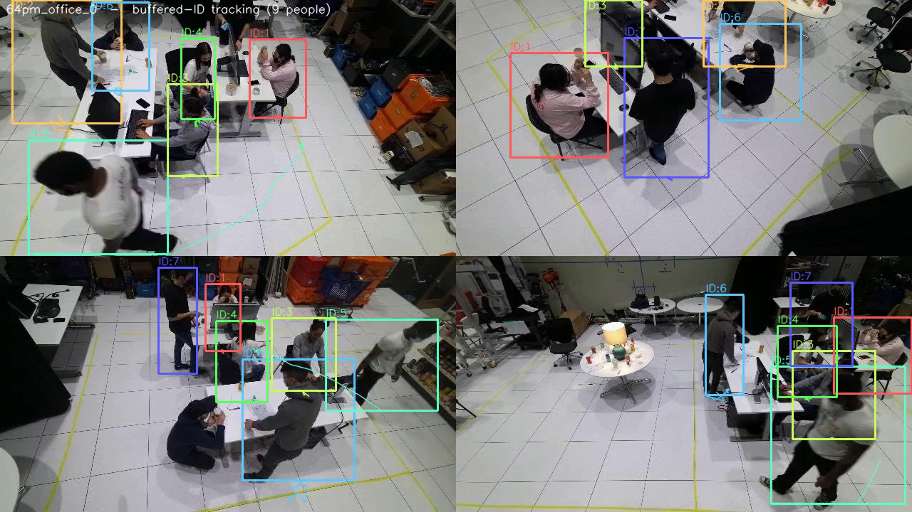
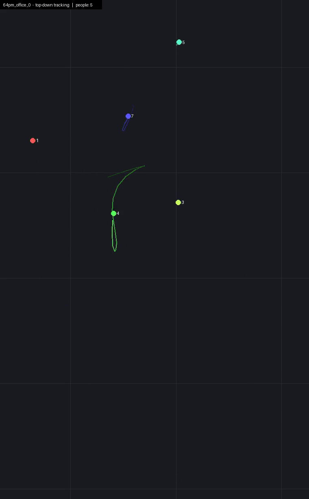
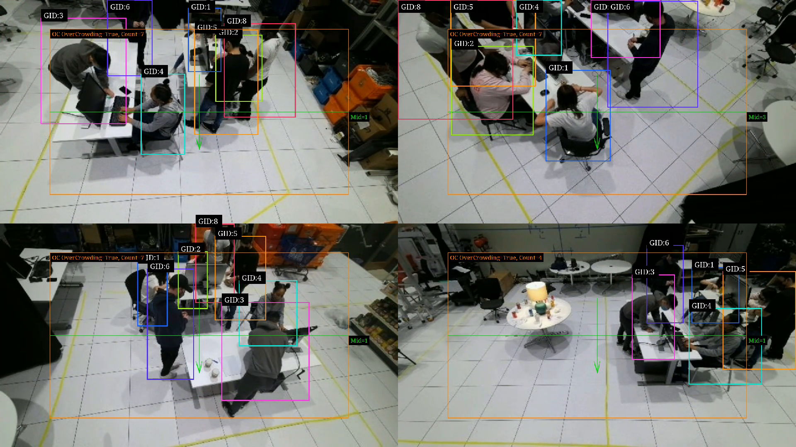
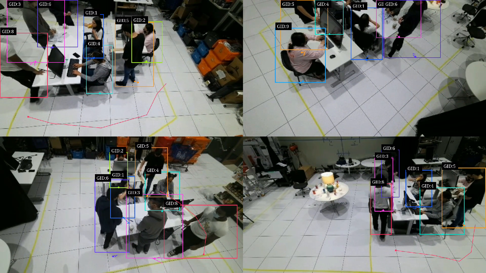
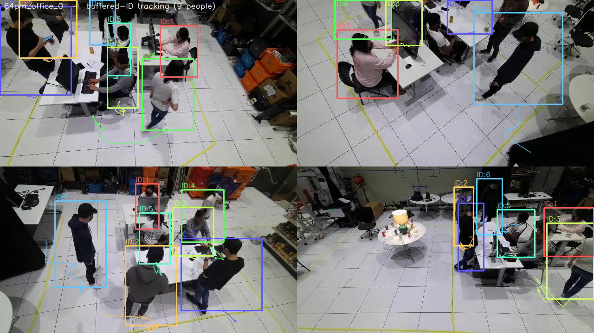

# Báo cáo ngày 22/06/2026
## Tình hình hệ thống theo dõi người đa camera — tracking, heatmap, video demo

**Phần cứng:** GPU NVIDIA RTX 5060 Ti (16 GB), Ubuntu 24.04, DeepStream 9.0.

---

## 1. Tổng quan hệ thống

Hệ thống theo dõi người qua nhiều camera, chạy thời gian thực, gồm hai tầng:

1. **Trong từng camera:** detector YOLO11 phát hiện người → tracker NvDCF gán *local track ID*
   (định danh nội bộ một camera) → trích đặc trưng ngoại hình (ReID) cho mỗi người.
2. **Cross camera:** gom các local ID của cùng một người ở các camera khác nhau thành **Global ID**
   (định danh toàn hệ thống), theo từng môi trường (mỗi môi trường = một cụm camera độc lập).

**Năng lực hiện tại:** 20 camera đồng thời, **~10–11 FPS/camera**, **độ chính xác định danh (Global
IDF1) ≈ 0.81**, VRAM ~9.4 GB. Đạt mục tiêu đề ra (20 camera @ 10 FPS, IDF1 ≥ 0.8).

---

## 2. Kết quả đo lường

### 2.1. Độ chính xác theo môi trường (Global IDF1)

| cafe_shop | lobby | office | industry | **retail** | **Trung bình** |
|---|---|---|---|---|---|
| 0.833 | 0.895 | 0.861 | 0.805 | **0.660** | **0.811** |

*Global IDF1: Đo trên mỗi khung hình chạy đúng một lần, chấm trên toàn bộ ground truth, không lặp video.*

### 2.2. So với mốc 18/06

| | 18/06 | 22/06 |
|---|---|---|
| Mean Global IDF1 | 0.802 | **0.811** |
| Throughput | ~18 FPS/cam | ~10–11 FPS/cam |

Tích hợp thực tế model ReID ban đầu vào NvDCF tracker (reidType:2) có xử lý đầu vào riêng khác với model ReID được huấn luyện nên làm giảm độ chính xác. Vì vậy model ReID được tách riêng ra sử dụng SGIE. Mức ~18 FPS chỉ đạt được khi giảm tần suất
detector, và khi đó độ chính xác tụt còn **~0.65** — tức **không thể vừa 18 FPS vừa IDF1 0.8** nên kết quả hôm trước đo được chưa chính xác và pipeline đang được cải thiện lại.

**Điểm yếu duy nhất:** môi trường **retail (0.66)**, do chất lượng embedding ReID ở môi trường này (nhiều
vật che)

---

## 3. Tính năng Tracking

- Phát hiện + bám người trong từng camera (box + local ID), vẽ **quỹ đạo di chuyển** lên video.
- Hợp nhất định danh **xuyên camera** thành Global ID ổn định.

Theo dõi trên từng camera — mỗi người một box + ID + vệt quỹ đạo:



Góc nhìn từ trên xuống (mặt sàn) — mỗi người một chấm màu + vệt đường đi:



### 3.1. Phân tích vùng bằng gst-nvdsanalytics

`gst-nvdsanalytics` là plugin phân tích của DeepStream, chạy **trên GPU** ngay sau detector/tracker.
Nó dựa vào **điểm chân** (đáy-giữa của box) mỗi người và vẽ kết quả **trực tiếp lên khung hình**.
Mỗi môi trường có **một cấu hình riêng** (`configs/analytics/nvdsanalytics_<môi-trường>.txt`) — vùng
ROI, vạch đếm và ngưỡng quá tải được **chỉnh theo bố cục thực tế của môi trường đó** (xem bảng ở
mục 6). Ba chức năng đang bật:

1. **ROI occupancy — đếm người trong vùng:** định nghĩa một **vùng sàn (ROI)**; plugin đếm số người
   đang đứng *bên trong* vùng đó theo thời gian thực. Dùng cho: đo mức sử dụng của một khu vực.
2. **Overcrowding — cảnh báo quá tải:** đặt **ngưỡng** cho vùng (đặt riêng theo từng môi trường,
   ví dụ cafe 6 / industry 8 / retail 5); khi vượt ngưỡng, plugin bật cờ **OVERCROWDED**. Dùng cho:
   cảnh báo an toàn / tụ tập đông.
3. **Line-crossing — đếm băng vạch:** định nghĩa một **vạch ảo có hướng**; plugin đếm số người **băng
   qua** vạch. Dùng cho: đếm người ra/vào, đo luồng di chuyển.

Mỗi camera có bộ quy tắc riêng (có thể đặt ROI/vạch khác nhau cho từng camera). Số đếm vừa hiển thị
trên video, vừa có thể ghi ra log/CSV để thống kê.

Ví dụ — vùng ROI + số người trong vùng, cảnh báo quá tải, và vạch đếm người ra/vào:



---

## 4. Định danh: Live ID và Buffered ID

Hệ thống có hai chế độ định danh, cần phân biệt khi xem video:

- **Live ID (tức thời):** gán Global ID ngay trong lúc chạy. Khi chưa đủ chắc chắn (người vừa vào, bị
  che, ảnh cắt dính rìa khung) nó sinh thêm ID mới hoặc để dấu hỏi `GID:?`. Hệ quả là số ID **phình to**:
  ở office, sinh tới **~98 ID** dù chỉ có **9 người** (xuất hiện nhãn `GID:9, GID:11, GID:?`).
- **Buffered ID (chính thức):** sau khi gom đủ một cửa sổ thời gian (~30 giây), hệ thống **gom cụm lại
  toàn bộ** ⇒ thu về **đúng 9 người ổn định**, không còn `GID:?`. **Mọi báo cáo, video demo và con số
  IDF1 0.81 đều dựa trên Buffered ID.**

| | Live ID | **Buffered ID (dùng chính thức)** |
|---|---|---|
| office_0 | ~98 ID, có `GID:?` | **9 ID ổn định** |

**Live ID — cùng góc 4 camera, số ID bị phình (`GID:9 / GID:11 / GID:?`):**



**Buffered ID — cùng góc 4 camera đó, 9 người với ID ổn định, không còn `GID:?` (chế độ dùng cho demo):**



### 4.1. Đưa Buffered ID lên video LIVE

Trước đây Buffered ID chỉ có ở bản dựng offline. Nay hệ thống **đưa kết quả Buffered (anchor-guided) ngược
lại OSD live**: khâu gom cụm `live_buffered` chạy song song, liên tục cập nhật bảng `(camera, track) →
Global ID`, pipeline đọc bảng này để **vẽ Buffered ID ngay trên video live** thay cho Live ID. Độ trễ
~1 cửa sổ (~30 giây); track mới chưa kịp gom thì tạm dùng Live ID rồi tự ổn định lại.

Kết quả: video live **không còn phình ID** — nhãn hội tụ về 9 người ổn định (`GID:1..9`, không `GID:?`).
Demo: `office_0_live_buffered_osd.mp4` (so với ảnh Live ID bị phình ở mục 4 để thấy rõ khác biệt).

---

## 5. Tính năng Heatmap

Bản đồ mật độ người, cho biết khu vực đông và lối đi hay sử dụng. Ba bản đồ theo **định nghĩa
chuẩn của ngành** (chi tiết định nghĩa + nguồn xem báo cáo [23/06](23062026.md) §1):

- **Occupancy — *mật độ hiện diện*:** tổng **thời gian** mỗi khu vực bị người chiếm chỗ → vùng
  rộng nơi người **ở lâu** (đây là bản "phủ vùng"). *Nguồn: occupancy heatmap, `gst-nvdsanalytics`
  ROI occupancy.*
- **Footfall — *lưu lượng*:** **số người khác nhau** đi qua mỗi khu vực (không phụ thuộc dừng bao
  lâu — người ngồi yên chỉ tính 1). *Nguồn: KPI footfall, `gst-nvdsanalytics` line-crossing.*
- **Dwell-time — *thời gian dừng*:** **thời gian trung bình một người** dừng tại mỗi khu vực =
  Occupancy ÷ Footfall. *Nguồn: Định luật Little (Little 1961).*

### (a) Theo từng camera (phủ lên khung hình thật)

| Occupancy (hiện diện) | Footfall (lưu lượng) | Dwell-time (thời gian dừng) |
|---|---|---|
|  |  |  |

(Ví dụ trên là camera 0; bộ đầy đủ cho cả 4 camera của **mỗi môi trường** nằm trong
`output/demo/<môi-trường>/heatmap/`.) Heatmap theo camera chính xác kể cả ở retail vì chỉ phụ
thuộc khâu phát hiện người.

### (b) Mặt sàn (nhìn từ trên xuống — BEV)

Gộp tất cả camera của một môi trường về **một bản đồ sàn duy nhất** qua calibration; lưới là thước đo
thật. Ba loại trên cùng một mặt sàn:

| Occupancy | Footfall | Dwell-time |
|---|---|---|
|  |  |  |

*Phạm vi bản đồ là **vùng người thực sự di chuyển**, vẽ đúng tỉ lệ mét thật. Dữ liệu MMPTracking không có
kích thước phòng/tường nên bản đồ không hiển thị tường — chỉ có calibration camera. Lưu ý: ở cảnh
**tĩnh** (office) ba bản đồ hội tụ gần nhau; chúng tách biệt rõ nhất ở cảnh có **luồng đi lại**.*

---

## 6. File demo

**Video trên Google Drive:**
https://drive.google.com/drive/folders/1939apVYKqarf1iCqwAM7akHM361qfjHb?usp=sharing

Thư mục `output/demo/` nay được **tổ chức lại theo từng môi trường**. Trước đây để phẳng và chỉ có
một môi trường (office); nay tách thành **5 thư mục con — mỗi môi trường một bộ demo đầy đủ riêng**.
Lý do đổi: (1) mỗi môi trường là **một cụm camera độc lập** nên gom riêng cho gọn và tự chứa;
(2) cấu hình phân tích (ROI/vạch/ngưỡng quá tải) được **chỉnh riêng theo bố cục từng môi trường**,
tách thư mục giúp thấy rõ điều đó; (3) tên file bỏ tiền tố ngày `64pm_…` cho ngắn gọn.

**Cấu trúc** — 5 môi trường: `office`, `cafe_shop`, `lobby`, `industry_safety`, `retail`. Mỗi
thư mục có cùng một bộ 3 video (đều dùng **Buffered ID**) + thư mục heatmap:

```
output/demo/<môi-trường>/
  <env>_live_buffered_osd.mp4   # 4 camera, OSD hiển thị Buffered ID ổn định + quỹ đạo (mục 4.1)
  <env>_tracking_bev.mp4        # nhìn từ trên xuống (mặt sàn): mỗi người một chấm màu + vệt đường đi
  <env>_analytics.mp4           # ROI đếm người + cảnh báo quá tải + vạch đếm — chỉnh riêng từng env
  heatmap/                      # 15 ảnh: cam_{0..3}_{occupancy,footfall,dwelltime}.png + bev_{...}.png
```

**Cấu hình phân tích (`<env>_analytics.mp4`) chỉnh riêng cho từng môi trường** — ROI phủ đúng khu
hoạt động, ngưỡng quá tải đặt theo số người điển hình:

| Môi trường | Bố cục | Ngưỡng quá tải | Định danh Buffered (số người) |
|---|---|---|---|
| office | bàn làm việc | (mặc định) | 9 |
| cafe_shop | bàn tròn trung tâm, người ngồi | 6 | ~7 |
| lobby | sàn mở, người đi lại | 6 | 7 |
| industry_safety | nhà xưởng, đông hơn | 8 | 9 |
| retail | lối đi giữa kệ hàng (nhiều vật che) | 5 | 10 |

Ý nghĩa 3 loại heatmap (occupancy / footfall / dwell-time) xem mục 5; mỗi môi trường có bộ riêng
trong thư mục `heatmap/` của nó.

---

## 7. Tổng kết & hướng tiếp theo

1. Hệ thống **đạt mục tiêu**: 20 camera @ ~10–11 FPS, **Global IDF1 ≈ 0.81** (đo trung thực).
2. Tính năng đầy đủ: **tracking** đa camera + phân tích vùng, **heatmap** (theo camera và mặt sàn),
   **video demo** dùng định danh ổn định (Buffered ID).
3. **Cần cải thiện:** môi trường **retail (0.66)** — hướng đi là dữ liệu retail thật hơn, không phải đổi kiến trúc mô hình (xem báo cáo [23/06](23062026.md) §5).
4. **Tăng tốc (đã thử — xem báo cáo [23/06](23062026.md) §3):** lượng tử hoá INT8 giữ IDF1 nhưng
   **không tăng FPS** (chỉ tiết kiệm VRAM); không có cần gạt nào đồng thời tăng FPS và giữ IDF1 —
   nút thắt là xử lý per-người trên GPU ở kích thước cố định, không co lại khi INT8.
