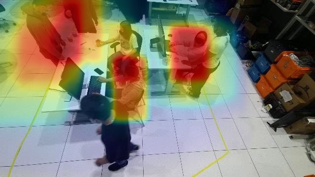
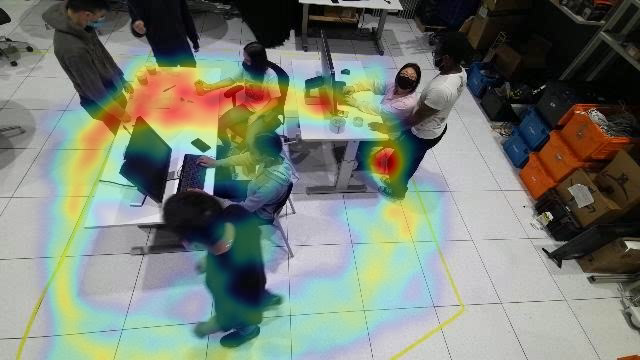
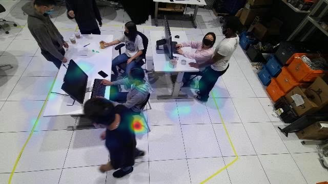
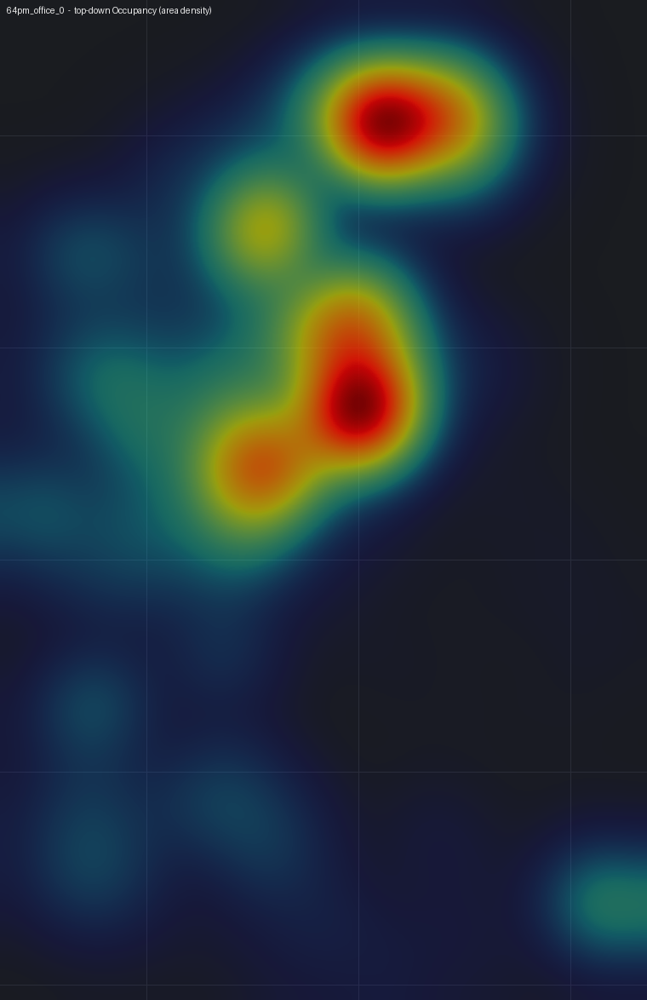
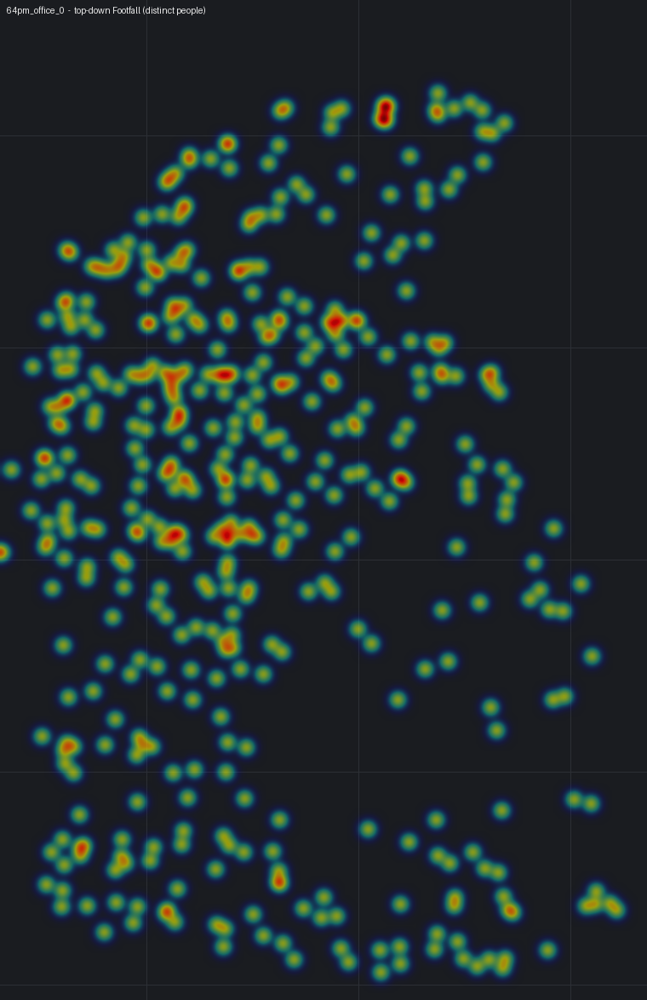
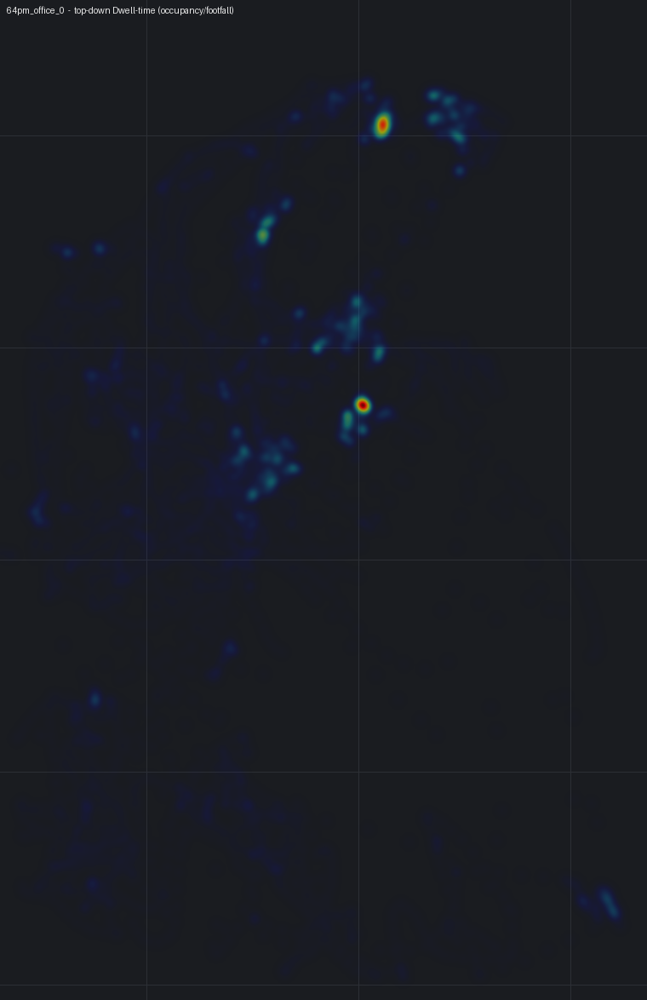

# Báo cáo ngày 23/06/2026
## Chuẩn hoá định nghĩa heatmap & làm rõ tên gọi định danh "Buffered"

**Phần cứng:** GPU NVIDIA RTX 5060 Ti (16 GB), Ubuntu 24.04, DeepStream 9.0.
Tiếp nối báo cáo [22/06](22062026.md) — bổ sung hai nội dung: (1) đặt lại tên các loại
heatmap theo **định nghĩa chuẩn của ngành** (không dùng metric tự chế), (2) giải thích tên
gọi của lớp định danh **Buffered**.

---

## 1. Heatmap — chuẩn hoá theo định nghĩa chuẩn

### 1.1. Vấn đề của bộ tên cũ (foot / dwell / visit)

Báo cáo trước đặt tên heatmap là **foot / dwell / visit**. Đây là tên **tự đặt theo cách
tính**, không phải metric chuẩn, và có vấn đề:

- **foot** (đếm tại điểm chân, sắc nét) và **dwell** (đếm trên cả khung người, vùng rộng)
  thực chất **cùng đo một đại lượng** — mức hiện diện theo thời gian — chỉ khác độ "rộng"
  khi vẽ. Vì vậy trong cảnh tĩnh (người ngồi) hai bản đồ **trông gần giống nhau**.
- **dwell** bị gọi nhầm: trong phân tích bán lẻ/giám sát, "dwell" (dwell-time) là **thời
  gian trung bình một người dừng lại**, là một metric *khác hẳn*, không phải "vùng hiện diện".

### 1.2. Bộ ba metric chuẩn (occupancy / footfall / dwell-time)

Giữ nguyên *cách thể hiện* (đặc biệt là bản đồ "phủ vùng" rộng mà mentor muốn giữ), nhưng
gắn mỗi bản đồ với **một định nghĩa có nguồn**:

| Tên (chuẩn) | Định nghĩa | Cách tính | Nguồn |
|---|---|---|---|
| **Occupancy** (mật độ hiện diện) | Tổng **thời gian** mỗi khu vực bị người chiếm chỗ (tích luỹ dấu chân/khung người qua mọi khung hình) → **bản đồ phủ vùng rộng** | Σ theo khung hình của footprint mỗi người trên từng ô | Bản đồ *occupancy/density* tiêu chuẩn trong giám sát video; trong hệ thống là plugin DeepStream `gst-nvdsanalytics` **ROI occupancy** (đếm người trong vùng) — đây là phiên bản theo-vùng của cùng khái niệm |
| **Footfall** (lưu lượng) | **Số người khác nhau** đi qua mỗi khu vực (không phụ thuộc dừng bao lâu) | Đếm số *track riêng biệt* chạm vào mỗi ô | KPI **footfall / people-counting** chuẩn của phân tích bán lẻ; trong hệ thống tương ứng `gst-nvdsanalytics` **line-crossing** (đếm băng vạch) |
| **Dwell-time** (thời gian dừng) | **Thời gian trung bình một người** dừng tại mỗi khu vực | **Occupancy ÷ Footfall** | **Định luật Little** (Little's Law): W = L / λ — thời gian trung bình trong hệ = số người trung bình hiện diện ÷ tốc độ đến. *J. D. C. Little, "A Proof for the Queuing Formula L = λW", Operations Research 9(3), 1961.* |

Quan hệ giữa ba đại lượng là **Định luật Little**: `dwell-time = occupancy / footfall`. Nhờ
đó bộ ba **không trùng nhau** và mỗi cái có ý nghĩa riêng:

- **Occupancy** sáng ở nơi *tổng thời gian* có người nhiều (bàn làm việc, khu chờ).
- **Footfall** sáng ở nơi *nhiều người khác nhau* đi qua (lối đi, cửa ra vào).
- **Dwell-time** sáng ở nơi *mỗi người dừng lâu* (ít người nhưng ở lâu — ví dụ một chỗ ngồi).

> Lưu ý: bản đồ **Occupancy** chính là bản "phủ vùng" rộng (trước đây gọi nhầm là *dwell*) —
> được **giữ nguyên cách thể hiện**, chỉ đổi tên cho đúng định nghĩa. Bản đồ "foot" sắc nét
> cũ chỉ là Occupancy ở mức điểm-chân nên đã được gộp lại, không còn là một loại riêng.

### 1.3. Ví dụ

Theo từng camera (ví dụ camera 0) — phủ lên khung hình thật:

| Occupancy (mật độ hiện diện) | Footfall (lưu lượng) | Dwell-time (thời gian dừng) |
|---|---|---|
|  |  |  |

Mặt sàn (nhìn từ trên xuống — gộp tất cả camera của môi trường về một bản đồ, lưới = mét thật):

| Occupancy | Footfall | Dwell-time |
|---|---|---|
|  |  |  |

Bộ đầy đủ cho cả 4 camera + mặt sàn nằm trong `output/demo/heatmap/`
(`cam_{0..3}_{occupancy,footfall,dwelltime}.png` và `bev_{occupancy,footfall,dwelltime}.png`).

> Lưu ý về cảnh: trong môi trường **tĩnh** (office — đa số người ngồi yên), ba bản đồ vẫn
> hội tụ gần nhau vì gần như không có di chuyển; chúng **tách biệt rõ nhất ở cảnh có luồng
> đi lại** (lobby, retail, cửa ra vào). Đây là tính chất đúng của định nghĩa, không phải lỗi.

---

## 2. Tên gọi lớp định danh "Buffered" và "anchor-guided"

**Câu hỏi:** có nên đổi tên *Buffered ID* thành *anchor-guided* (đúng thuật toán đang dùng) không?

**Khuyến nghị: giữ tên "Buffered ID"**, và **ghi chú thuật toán là *anchor-guided***. Lý do:

- **"Buffered"** mô tả **chế độ vận hành** mà mentor nhìn thấy trên video: hệ thống *gom đệm*
  một cửa sổ thời gian rồi *gom cụm lại* để cho ra định danh ổn định. Tên này tạo cặp đối lập
  rõ ràng với **"Live ID"** (định danh tức thời) — đúng trục so sánh đang trình bày ở báo cáo.
- **"anchor-guided"** mô tả **thuật toán bên trong** dùng để gom cụm, chứ không phải chế độ
  vận hành. Đổi hẳn sang tên này sẽ **mất** cặp đối lập Live ↔ Buffered.

Nói cách khác, hai tên ở hai tầng khác nhau và **bổ sung cho nhau**:

| Tầng | Tên | Ý nghĩa |
|---|---|---|
| Chế độ vận hành (mentor thấy) | **Buffered ID** | Gom đệm 1 cửa sổ rồi gom cụm → ID ổn định, đối lập với Live ID |
| Thuật toán bên trong | **anchor-guided** | Cách gom cụm: dựng *anchor* rồi gán Hungarian theo từng khung/từng camera, vote theo cửa sổ |

**Thuật toán anchor-guided là gì (định nghĩa + nguồn):** bám theo phương pháp **anchor-guided
clustering của AI City Challenge 2023 (AIC23)** — tài liệu gốc trong repo: `docs/anchor-guided.pdf`.
Hệ thống tái hiện trong `src/eval/offline_anchor_faithful.py` (`build_anchors` + `assign_per_frame`)
và chạy online qua `src/mtmc/live_buffered.py`. Khác biệt với bản hợp nhất cũ
(`micro_batch_fusion`): micro-batch gom cụm bằng Hungarian **ở tầng xuyên-camera** (theo
tracklet-mean), còn anchor-guided gán Hungarian **ở tầng từng-camera/từng-khung** rồi mới khâu
nối các cửa sổ — bám sát công thức AIC23 hơn.

**Đề xuất câu chữ thống nhất trong tài liệu/giao diện:** gọi là **"Buffered ID (anchor-guided)"** —
giữ tên vận hành quen thuộc, kèm tên thuật toán có nguồn trong ngoặc. Không cần đổi tên code.

---

## 3. Tổng kết

1. Heatmap đã được **đặt lại tên theo định nghĩa chuẩn**: **Occupancy / Footfall / Dwell-time**
   (gắn nguồn: occupancy/footfall theo `gst-nvdsanalytics`, dwell-time theo Định luật Little 1961).
   Bản "phủ vùng" rộng được **giữ nguyên** dưới tên đúng là *Occupancy*.
2. Lớp định danh giữ tên **Buffered ID**, ghi chú thuật toán **anchor-guided (AIC23,
   `docs/anchor-guided.pdf`)**; khuyến nghị viết gọn là **"Buffered ID (anchor-guided)"**.
